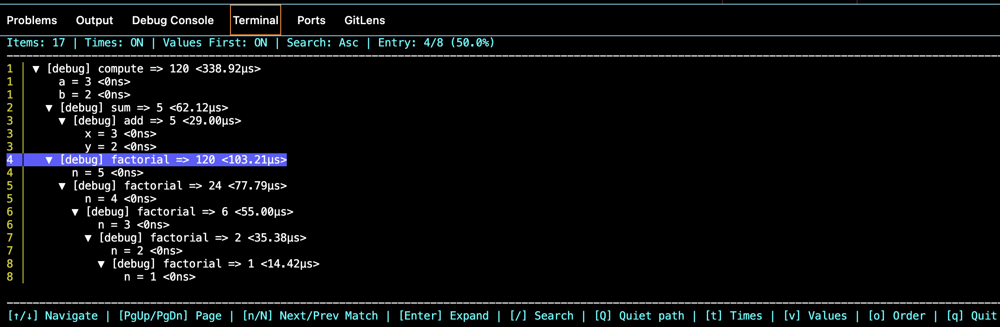
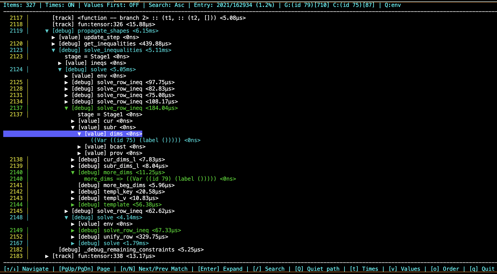

# ppx_minidebug

**Debug logging for OCaml with interactive trace exploration**

`ppx_minidebug` is a PPX extension that automatically instruments your OCaml code with debug logging. Traces are stored in a SQLite database and explored via an interactive TUI, making it easy to understand program execution, debug issues, and analyze behavior.

NOTE: `ppx_minidebug` 3.0 requires a Unix terminal.  See [ppx_minidebug 2.4.0](https://ocaml.org/p/ppx_minidebug/2.4.0) ([2.4.x-static-artifacts branch](https://github.com/lukstafi/ppx_minidebug/tree/2.4.x-static-artifacts)) for a version that has poor scaling because it produces pre-rendered artifacts from debugging, but is platform-independent.

## Quick Start

### Installation

```bash
opam install ppx_minidebug
```

### Basic Usage

Add to your `dune` file:
```lisp
(executable
  (name my_program)
  (libraries ppx_minidebug.runtime)
  (preprocess (pps ppx_minidebug)))
```

Instrument your code:
```ocaml
open Sexplib0.Sexp_conv

(* Setup database runtime *)
let _get_local_debug_runtime =
  let rt = Minidebug_db.debug_db_file "my_trace" in
  fun () -> rt

(* Annotate functions with %debug_sexp *)
let%debug_sexp rec factorial (n : int) : int =
  if n <= 1 then 1
  else n * factorial (n - 1)

let () =
  Printf.printf "5! = %d\n" (factorial 5)
```

Run and explore:
```bash
./my_program              # Creates my_trace_1.db
minidebug_view my_trace.db tui   # Launch interactive TUI
```



## Why ppx_minidebug?

- **Zero runtime overhead with compile-time filtering**: `[%%global_debug_log_level 0]` eliminates all logging code
- **Interactive exploration**: Navigate traces with vim-like keybindings, search with regex, auto-expand to matches
- **Efficient storage**: Content-addressed deduplication + recursive sexp caching minimize database size
- **Fast mode**: ~100x speedup with top-level transactions
- **Type-driven**: Only logs what you annotate — precise control over verbosity
- **Three serialization backends**: `%debug_sexp` (sexplib0), `%debug_show` (ppx_deriving.show), `%debug_pp` (Format)

## Features

### Interactive TUI

Launch the TUI to explore your traces interactively:

```bash
minidebug_view trace.db tui
```

**Navigation:**
- `↑`/`↓` or `j`/`k`: Move cursor up/down
- `Home`/`End`: Jump to first/last entry
- `PgUp`/`PgDown` (or `Fn+↑`/`Fn+↓`): Page navigation
- `u`/`d`: Quarter-page navigation (1/4 screen)
- `Enter` or `Space`: Expand/collapse entry

**Search:**
- `/`: Open search prompt (supports 4 concurrent searches: S1-S4)
- `n`/`N`: Jump to next/previous match (auto-expands tree to reveal match)
- `Q`: Set quiet path filter (stops highlight propagation at matching ancestors)
- `o`: Toggle search ordering (Ascending/Descending scope_id)

**Display:**
- `t`: Toggle elapsed times
- `v`: Toggle values-first mode
- `q`: Quit



### CLI Commands

```bash
# Show database statistics
minidebug_view trace.db stats

# Display full trace tree
minidebug_view trace.db show

# Compact view (function names + timing only)
minidebug_view trace.db compact

# Search from CLI
minidebug_view trace.db search "pattern"

# Export to markdown
minidebug_view trace.db export > trace.md

# List top-level entries (efficient for large databases)
minidebug_view trace.db roots
```

## Extension Points

`ppx_minidebug` provides three families of extension points:

### `%debug_*` — Standard debugging
Logs parameters, return values, and let-bound values, where type annotated:
```ocaml
let%debug_sexp fibonacci (n : int) : int = ...
```

### `%track_*` — Control flow tracking
Additionally logs which branches are taken in `if`, `match`, `function`, `for`, and `while`:
```ocaml
let%track_sexp process_list (items : int list) : int =
  match items with  (* branch info logged *)
  | [] -> 0
  | x :: xs -> x + process_list xs
```

### `%diagn_*` — Diagnostic logging
For explicit logs only (ignores function parameters/results/bindings unless explicitly logged with `%log`):
```ocaml
let%diagn_sexp complex_computation (x : int) : int =
  let y : int = step1 x in (* not logged despite type annotation *)
  let z : int =
    if rare_case y then ([%log "found this:", (y : int)]; step_rare y) else step2 y in
  z * 2  (* result not logged *)
```

Each family supports three serialization methods:
- `%debug_sexp` / `%track_sexp` / `%diagn_sexp` — requires `ppx_sexp_conv`
- `%debug_show` / `%track_show` / `%diagn_show` — requires `ppx_deriving.show`
- `%debug_pp` / `%track_pp` / `%diagn_pp` — requires custom `pp` functions

## Runtime Configuration

### Basic Setup

```ocaml
(* Single database file shared across all traces *)
let _get_local_debug_runtime =
  let rt = Minidebug_db.debug_db_file "my_debug" in
  fun () -> rt
```

**Important:** Use the pattern `let rt = ... in fun () -> rt` to ensure a single runtime instance is shared across all calls. This prevents creating multiple database files.

### Configuration Options

```ocaml
let _get_local_debug_runtime =
  let rt = Minidebug_db.debug_db_file
    ~elapsed_times:Microseconds    (* Show elapsed time in microseconds *)
    ~log_level:2                    (* Only log entries at level 2 or higher *)
    ~print_scope_ids:true          (* Include scope IDs in output *)
    ~path_filter:(`Whitelist (Re.compile (Re.str "my_module")))  (* Filter by path *)
    ~run_name:"test_run_1"         (* Name this trace run *)
    "my_debug"
  in
  fun () -> rt
```

Available options:
- `time_tagged`: Clock time timestamps (Elapsed, Absolute, or Nothing)
- `elapsed_times`: Elapsed time precision (Seconds, Milliseconds, Microseconds, Nanoseconds)
- `location_format`: Source location format (File_line, File_only, No_location)
- `print_scope_ids`: Show scope IDs in output
- `verbose_scope_ids`: Show full scope ID details
- `run_name`: Name for this trace run (stored in metadata database)
- `log_level`: Minimum log level to record (0 = log everything)
- `path_filter`: Whitelist/Blacklist regex for file paths

### File Versioning

`ppx_minidebug` automatically versions database files to prevent conflicts:

```ocaml
(* Three runtime instances in same process *)
let rt1 = Minidebug_db.debug_db_file "trace" in  (* Creates trace_1.db *)
let rt2 = Minidebug_db.debug_db_file "trace" in  (* Creates trace_2.db *)
let rt3 = Minidebug_db.debug_db_file "trace" in  (* Creates trace_3.db *)
```

A symlink `trace.db` points to the latest versioned file. Run metadata is stored in `trace_meta.db`.

## Log Levels

Control logging verbosity with compile-time and runtime log levels:

### Compile-time filtering

```ocaml
(* Remove all logging code at compile time *)
[%%global_debug_log_level 0]

(* Only include level 2+ logs in compiled code *)
[%%global_debug_log_level 2]

(* Read level from environment variable at compile time *)
[%%global_debug_log_level_from_env_var "DEBUG_LEVEL"]
```

Explicit log levels on extension points:
```ocaml
let%debug2_sexp verbose_function (x : int) : int = ...  (* Only logged if level >= 2 *)
let%debug1_sexp normal_function (x : int) : int = ...   (* Logged if level >= 1 *)
```

### Runtime filtering

```ocaml
(* Runtime log level filters what gets recorded *)
let _get_local_debug_runtime =
  let rt = Minidebug_db.debug_db_file ~log_level:2 "trace" in
  fun () -> rt
```

### Path Filtering

Filter logs by file path or function name:

```ocaml
(* Whitelist: only log from my_module.ml *)
let _get_local_debug_runtime =
  let rt = Minidebug_db.debug_db_file
    ~path_filter:(`Whitelist (Re.compile (Re.str "my_module")))
    "trace"
  in
  fun () -> rt

(* Blacklist: exclude test utilities *)
let _get_local_debug_runtime =
  let rt = Minidebug_db.debug_db_file
    ~path_filter:(`Blacklist (Re.compile (Re.alt [
      Re.str "test_utils";
      Re.str "mock_"
    ])))
    "trace"
  in
  fun () -> rt

(* Filter by function name prefix *)
let _get_local_debug_runtime =
  let rt = Minidebug_db.debug_db_file
    ~path_filter:(`Whitelist (Re.compile (Re.seq [
      Re.rep Re.any;
      Re.str "/process_";
      Re.rep Re.any
    ])))
    "trace"
  in
  fun () -> rt
```

Path filters are applied to the `"file/function_or_binding_name"` pattern.

## Advanced Usage

See [README_LEGACY.md](README_LEGACY.md) for a more detailed description and full coverage of many features not mentioned here.

### Explicit Logging with `%log`

Log arbitrary computations explicitly, don't compute them when logging disabled:

```ocaml
let%debug_sexp complex_calculation (x : int) : int =
  let intermediate : int = x * 2 in      (* Logged binding *)
  [%log "Let's check", (expensive_analysis intermediate : sexpable_analysis_result)];
  let result : int = intermediate + 5 in (* Logged binding *)
  result  (* Also logged as return value *)
```

### Anonymous Functions and Insufficient Annotations

Use `%track_*` to log anonymous functions and unannotated bindings:

```ocaml
let%track_sexp process_items (items : int list) : int list =
  List.map (fun x -> x * 2) items  (* Anonymous function logged *)
```

### Concurrent Execution

Each thread/domain should have its own runtime instance. The recommended approach is to have a single `_get_local_debug_runtime` function which returns the runtime (first-class module) from a domain-local or thread-local storage. In more complex cases, various other options are possible, e.g.:

```ocaml
let create_runtime () =
  let rt = Minidebug_db.debug_db_file "worker" in
  fun () -> rt

let worker_thread () =
  let _get_local_debug_runtime = create_runtime () in
  (* Worker code with instrumentation *)
  ...
```

Each thread creates a separate versioned database file (`worker_1.db`, `worker_2.db`, etc.).

## Performance

### Fast Mode (Default)

`ppx_minidebug` uses "Fast mode" by default, providing ~100x speedup over naive autocommit:

- **Top-level transactions**: `BEGIN` when entering top-level scope, `COMMIT` when exiting
- **DELETE journal + synchronous=OFF**: Trades durability for speed
- **Automatic commit**: `at_exit` handlers and signal handlers (SIGINT, SIGTERM) ensure safe commits

The database is **unlocked between top-level traces**, allowing the TUI to read while your program runs.

### Lazy Initialization

Database files are created lazily — only when the first log is written. If all logs are filtered out (compile-time `log_level=0` or runtime filtering), no database file is created.

### Deduplication

Two-level deduplication minimizes database size:

1. **Content-addressed value storage**: MD5 hash-based O(1) deduplication of logged values
2. **Recursive sexp caching**: During boxify (large value decomposition), repeated substructures are cached and reused

Example: Logging a list of 1000 identical trees stores each unique tree structure only once.

This scales to much bigger logging loads, in particular when the sharing opportunity is exposed. Taking full benefit of deduplication requires some work on / adaptation of the debugged program, because persistent data-structures in OCaml typically don't expose the underlying tree structure, and their default `sexp_of` conversions serialize into flat lists. 

## Type Annotations

`ppx_minidebug` requires type annotations to determine how to serialize values:

```ocaml
(* ✓ Will be logged *)
let%debug_sexp foo (x : int) (y : string) : int = ...

(* ✗ Not logged — missing type annotations *)
let%debug_sexp bar x y = x + y
```

For local bindings:
```ocaml
let%debug_sexp compute (x : int) : int =
  let y : int = x * 2 in    (* ✓ Logged *)
  let z = y + 5 in          (* ✗ Not logged — no type annotation *)
  z
```

Tip: Add/remove type annotations to control logging granularity without changing extension points.

## Comparison with Legacy Backends

`ppx_minidebug` 3.0+ uses a database backend by default. Previous versions (2.x) used static HTML/Markdown/text file generation.

**Why database backend?**
- Interactive exploration with TUI (search, navigation, auto-expand)
- Handles large traces (100M+ entries) efficiently
- Content-addressed deduplication reduces storage
- Single source of truth (no scattered HTML files)
- Queryable with standard SQL tools

**Migration:** Change `Minidebug_runtime.debug_file` to `Minidebug_db.debug_db_file`. See [README_LEGACY.md](README_LEGACY.md) for 2.x documentation.

## Technical Details

- **Database**: SQLite with content-addressed value storage
- **Schema**: Composite keys `(scope_id, seq_id)` for chronological ordering
- **TUI**: Built with Notty, concurrent search using OCaml Domains
- **Boxify**: Large sexps decomposed into nested scopes with indentation-based parsing
- **Metadata database**: Separate `*_meta.db` tracks runs across versioned files

See [DATABASE_BACKEND.md](DATABASE_BACKEND.md) for complete technical documentation.

## Examples

See the `test/` directory for extensive examples:
- [test_debug_sexp.ml](test/test_debug_sexp.ml) — Basic sexp logging
- [test_expect_test.ml](test/test_expect_test.ml) — Comprehensive test suite with 60+ examples
- [test_path_filter.ml](test/test_path_filter.ml) — Path filtering examples

## Related Tools

- [`ppx_debug`](https://github.com/dariusf/ppx_debug) — Complementary PPX with different design trade-offs
- [Landmarks](https://github.com/LexiFi/landmarks) — Profiling-focused tracing
- [Ocaml-trace](https://github.com/c-cube/ocaml-trace) — Tracing library with backend support

## Contributing

Contributions welcome! See [CLAUDE.md](CLAUDE.md) for development guide.

## License

MIT License — see [LICENSE](LICENSE)

## Changelog

See [CHANGELOG.md](CHANGELOG.md) for version history.
