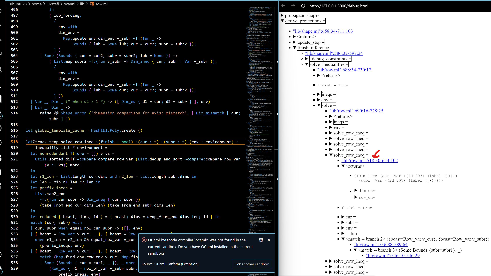
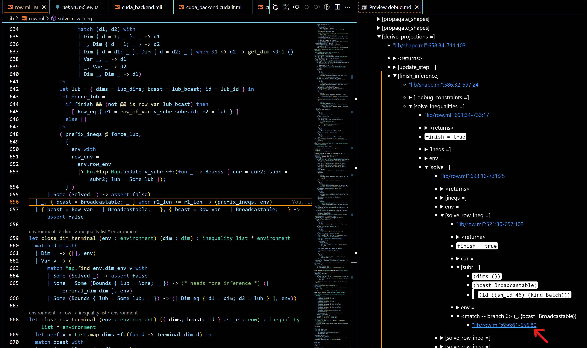
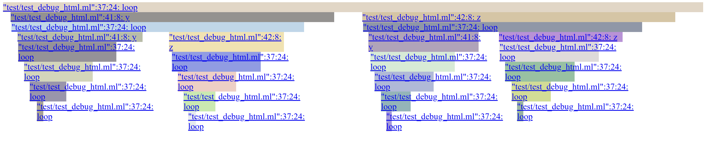
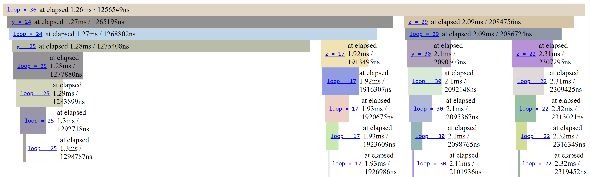

# ppx_minidebug

<!-- TOC -->

- [ppx_minidebug](#ppx_minidebug)
  - [ppx_minidebug: Debug logs for selected functions and let-bindings](#ppx_minidebug-debug-logs-for-selected-functions-and-let-bindings)
    - [Traces in HTML or Markdown as collapsible trees](#traces-in-html-or-markdown-as-collapsible-trees)
    - [Highlighting search terms](#highlighting-search-terms)
    - [Highlighting differences between runs](#highlighting-differences-between-runs)
    - [PrintBox creating helpers with defaults: debug and debug_file](#printbox-creating-helpers-with-defaults-debug-and-debug_file)
    - [Hyperlinks to source locations](#hyperlinks-to-source-locations)
    - [values_first_mode](#values_first_mode)
  - [Usage](#usage)
    - [Breaking infinite recursion with max_nesting_depth and looping with max_num_children; Flushing-based traces](#breaking-infinite-recursion-with-max_nesting_depth-and-looping-with-max_num_children-flushing-based-traces)
    - [Tracking: control flow branches, anonymous and insufficiently annotated functions](#tracking-control-flow-branches-anonymous-and-insufficiently-annotated-functions)
    - [Using as a logging framework](#using-as-a-logging-framework)
      - [Specifying the level to log at via a runtime expression](#specifying-the-level-to-log-at-via-a-runtime-expression)
    - [Lexical scopes vs. dynamic scopes](#lexical-scopes-vs-dynamic-scopes)
    - [Reducing the size of generated logs](#reducing-the-size-of-generated-logs)
    - [Navigating large logs](#navigating-large-logs)
    - [Providing the necessary type information](#providing-the-necessary-type-information)
    - [Dealing with concurrent execution](#dealing-with-concurrent-execution)

<!-- /TOC -->

## `ppx_minidebug`: Debug logs for selected functions and let-bindings

`ppx_minidebug` traces let bindings and functions within a selected scope if they have type annotations. `ppx_minidebug` offers three ways of instrumenting the code: `%debug_pp` and `%debug_show` (also `%track_pp`, `%diagn_pp` and `%track_show`, `%diagn_show`), based on `deriving.show`, and `%debug_sexp` (also `%track_sexp`, `%diagn_sexp`) based on `sexplib0` and `ppx_sexp_conv`. Explicit logs can be added with `%log` within a debug scope (`%log` is not a registered extension point to avoid conflicts with other logging frameworks). The syntax extension expects a module `Debug_runtime` in the scope. The `ppx_minidebug.runtime` library (part of the `ppx_minidebug` package) offers multiple ways of logging the traces, as helper functions generating `Debug_runtime` modules. See [the generated documentation for `Minidebug_runtime`](https://lukstafi.github.io/ppx_minidebug/ppx_minidebug/Minidebug_runtime/index.html).

Take a look at [`ppx_debug`](https://github.com/dariusf/ppx_debug) which has complementary strengths!

Try `opam install ppx_minidebug` to install from the opam repository. To install the development version of `ppx_minidebug`, download it with e.g. `gh repo clone lukstafi/ppx_minidebug; cd ppx_minidebug` and then `dune build; opam install .`.

To use `ppx_minidebug` in a Dune project, add/modify these stanzas: `(preprocess (pps ... ppx_minidebug))`, and `(libraries ... ppx_minidebug.runtime)`.

Here we define a `Debug_runtime` either using the entrypoint `module Debug_runtime = (val Minidebug_runtime.debug ())`,
or using the `PrintBox` functor, e.g.:

```ocaml
module Debug_runtime =
  Minidebug_runtime.PrintBox((val Minidebug_runtime.shared_config "path/to/debugger_printbox.log" end))
let () = Debug_runtime.config.values_first_mode <- false
```

The logged traces will be pretty-printed as trees using the `printbox` package. Truncated example (using `%debug_sexp`):

```shell
BEGIN DEBUG SESSION
"test/test_debug_sexp.ml":7:19-9:17: foo
├─x = 7
├─"test/test_debug_sexp.ml":8:6: y
│ └─y = 8
└─foo = (7 8 16)
"test/test_debug_sexp.ml":15:19-17:14: bar
├─x = ((first 7) (second 42))
├─"test/test_debug_sexp.ml":16:6: y
│ └─y = 8
└─bar = 336
"test/test_debug_sexp.ml":21:19-24:28: baz
├─x = ((first 7) (second 42))
├─"test/test_debug_sexp.ml":22:17: _yz
│ └─_yz = (8 3)
├─"test/test_debug_sexp.ml":23:17: _uw
│ └─_uw = (7 13)
└─baz = 359
"test/test_debug_sexp.ml":28:19-30:17: lab
├─x = 7
├─"test/test_debug_sexp.ml":29:6: y
│ └─y = 8
└─lab = (7 8 16)
"test/test_debug_sexp.ml":34:24-40:9: loop
├─depth = 0
├─x = ((first 7) (second 42))
├─"test/test_debug_sexp.ml":38:8: y
│ ├─"test/test_debug_sexp.ml":34:24-40:9: loop
│ │ ├─depth = 1
│ │ ├─x = ((first 41) (second 9))
│ │ ├─"test/test_debug_sexp.ml":38:8: y
│ │ │ ├─"test/test_debug_sexp.ml":34:24-40:9: loop
│ │ │ │ ├─depth = 2
│ │ │ │ ├─x = ((first 8) (second 43))
│ │ │ │ ├─"test/test_debug_sexp.ml":34:24-40:9: loop
│ │ │ │ │ ├─depth = 3
│ │ │ │ │ ├─x = ((first 44) (second 4))
│ │ │ │ │ ├─"test/test_debug_sexp.ml":34:24-40:9: loop
│ │ │ │ │ │ ├─depth = 4
│ │ │ │ │ │ ├─x = ((first 5) (second 22))
│ │ │ │ │ │ ├─"test/test_debug_sexp.ml":34:24-40:9: loop
│ │ │ │ │ │ │ ├─depth = 5
│ │ │ │ │ │ │ ├─x = ((first 23) (second 2))
│ │ │ │ │ │ │ └─loop = 25
```

### Traces in HTML or Markdown as collapsible trees

The `PrintBox` runtime can be configured to output logs using HTML or Markdown. The logs then become collapsible trees, so that you can expose only the relevant information when debugging. Example configuration:

```ocaml
module Debug_runtime =
  Minidebug_runtime.PrintBox ((val Minidebug_runtime.shared_config "debug.html"))
let () =
  let c = Debug_runtime.config in
  c.backend <- `Html Minidebug_runtime.default_html_config;
  c.boxify_sexp_from_size <- 50;
  c.values_first_mode <- false
```

Here we also convert the logged `sexp` values (with at least 50 atoms) to trees. Example result:


### Highlighting search terms

The `PrintBox` runtime also supports highlighting paths to logs that match a `highlight_terms`
regular expression. For example:


To limit the highlight noise, some log entries can be excluded from propagating the highlight status
using the `exclude_on_path` setting. To trim excessive logging while still providing some context,
you can set `prune_upto` to a level greater than 0, which only outputs highlighted boxes below that level.

### Highlighting differences between runs

The `PrintBox` runtime can highlight differences between the current run and a previous run's logs. This is useful for understanding how program behavior changes between executions. To enable this feature, provide the `prev_run_file` argument when creating the runtime. It should be the "raw" messages file of the previous run, including the `.raw` suffix:

```ocaml
module Debug_runtime =
  (val Minidebug_runtime.debug_file ~prev_run_file:"previous_run.raw" "current_run")
```

The highlighting of differences works independently from (and can be combined with) search term highlighting. The runtime will highlight entries that do not have a corresponding entry in the previous run: currently, deletions (previous run entries missing in the current run) do not affect the highlighting. Highlights comming from diffing runs are annotated with the diff reason (change or insertion). For a block-level highlight, the attached reason comes from the first diff encountered in the block. The ignore patterns are erased in the reason strings.

Note that the comparison is performed at the chunk level, where each chunk is a complete toplevel log tree. The log trees must match exactly: insertions and deletions of toplevel log trees are not supported. This limitation helps keep the comparison efficient but means you might have to coarsen the granularity of the log trees to get useful differences.

The `diff_ignore_pattern` setting can be used to ignore certain patterns in the logs. For example, to ignore message-level timestamps:

```ocaml
module Debug_runtime =
  (val Minidebug_runtime.debug_file ~prev_run_file:"previous_run.raw" ~diff_ignore_pattern:(Re.Pcre.re {|\[\d{4}-\d{2}-\d{2} \d{2}:\d{2}:\d{2}\]|}) "current_run")
```

Note that the timestamps of the log entries are not treated as messages, so are necessarily ignored.

For efficiency, the minimal edit distance search is limited, roughly speaking, to a band around the diagonal / greedy best match / forced match. The setting `max_distance_factor` controls the width of the band. (The implementation tweaks that heuristic somewhat to account for the tree structure.)

You can force aligning certain entry IDs via the setting `entry_id_pairs`. The previous run's entry IDs come first in the pairs. See the example [test/debug_diffs_align.ml](test/debug_diffs_align.ml):

```ocaml
  let module Debug_runtime =
    (val Minidebug_runtime.debug_file ~values_first_mode:false ~print_entry_ids:true
           ~backend:`Text ~prev_run_file:(prev_run ^ ".raw")
           ~entry_id_pairs:[ (2, 4); (8, 6) ]
             (* Force mappings: - Entry 2 (early prev) to Entry 4 (middle curr) - Entry 8
                (late prev) to Entry 6 (in the shorter curr) *)
           curr_run)
  in
```

### `PrintBox` creating helpers with defaults: `debug` and `debug_file`

The configuration for the above example is more concisely just:

```ocaml
module Debug_runtime = (val Minidebug_runtime.debug_file ~highlight_terms:(Re.str "169") "debug")
```

Similarly, `debug` returns a `PrintBox` module, which by default logs to `stdout`:

```ocaml
module Debug_runtime = (val Minidebug_runtime.debug ())
```

### Hyperlinks to source locations

The HTML and Markdown outputs support emitting file locations as hyperlinks. For example:

```ocaml
module Debug_runtime = (val Minidebug_runtime.debug_file ~hyperlink:"" "debug")
```

where `~hyperlink` is the prefix to let you tune the file path and select a browsing option. For illustration,
the prefixes for Markdown / HTML outputs I might use at the time of writing:

- `~hyperlink:"./"` or `~hyperlink:"../"` depending on the relative locations of the log file and the binary
- `~hyperlink:"vscode://file//wsl.localhost/Ubuntu/home/lukstafi/ppx_minidebug/"`
  - if left-clicking a link from within VS Code Live Preview follows the file in the HTML preview window rather than an editor window, middle-click the link
- `~hyperlink:"https://github.com/lukstafi/ppx_minidebug/tree/main/"`

### `values_first_mode`

This setting, by default `true`, puts the result of the computation as the header of a computation subtree, rather than the source code location of the computation. I recommend using this setting as it reduces noise and makes the important information easier to find and visible with less unfolding. Another important benefit is that it makes hyperlinks usable, by pushing them from the summary line to under the fold. It is the default setting, but can be disabled by passing `~values_first_mode:false` to runtime builders, because it can be confusing: the logs are no longer ordered by computation time. It is not available in the `Flushing` runtime.

For example:

```ocaml
module Debug_runtime =
  (val Minidebug_runtime.debug ~highlight_terms:(Re.str "3") ())
let%debug_show rec loop_highlight (x : int) : int =
  let z : int = (x - 1) / 2 in
  if x <= 0 then 0 else z + loop_highlight (z + (x / 2))
let () = print_endline @@ Int.to_string @@ loop_highlight 7
```

Truncated results:

```shell
BEGIN DEBUG SESSION
┌──────────────────┐
│loop_highlight = 9│
├──────────────────┘
├─"test/test_expect_test.ml":1042:41-1044:58
├─x = 7
├─┬─────┐
│ │z = 3│
│ ├─────┘
│ └─"test/test_expect_test.ml":1043:8
└─┬──────────────────┐
  │loop_highlight = 6│
  ├──────────────────┘
  ├─"test/test_expect_test.ml":1042:41-1044:58
  ├─x = 6
  ├─z = 2
  │ └─"test/test_expect_test.ml":1043:8
  └─┬──────────────────┐
    │loop_highlight = 4│
    ├──────────────────┘
    ├─"test/test_expect_test.ml":1042:41-1044:58
```

When logging uses sexps and boxification, and the result is decomposed into a subtree, only the header of the result subtree is put in the header line, and the rest of the result subtree is just underneath it with a `<returns>` or a `<values>` header. Example showcasing the `printbox-html` backend:


Example showcasing the `printbox-md` (Markdown) backend:


## Usage

Tracing only happens in explicitly marked lexical scopes. For extension points applied directly to bindings (let-definitions) only the `let` definition in scope for logging, the body of the definition(s) is considered outside the extension point. (But if the extension is over an expression with a nested let-binding, the body of the definition is in the scope of the extension.)

The entry extension points vary along three axes:

- `%debug_` vs. `%track_` vs. `%diagn_`
  - The prefix `%debug_` means logging fewer things: only let-bound values and functions are logged, and functions only when either: directly in a `%debug_`-annotated let binding, or their return type is annotated.
  - `%track_` also logs: which `if`, `match`, `function` branch is taken, `for` and `while` loops, and all functions, including anonymous ones.
  - The prefix `%diagn_` means only generating logs for explicitly logged values, i.e. introduced by `[%log ...]`, `[%log_result ...]`, `[%log_printbox ...]` statements.
- Optional infixes `_rt_` and `_l_`:
  - `_rt_` adds a first-class module argument to a function, and unpacks it as `module Debug_runtime` for the scope of the function.
  - `_l_` calls `_get_local_debug_runtime`, and unpacks it for the scope of the function: `let module Debug_runtime = (val _get_local_debug_runtime ()) in ...`.
  - This functionality is "one use only": it applies only to the function the extension point is attached to.
- Representation and printing mechanism: `_pp`, `_show`, recommended: `_sexp`
  - `_pp` is currently most restrictive as it requires the type of a value to be an identifier. The identifier is converted to a `pp_` printing function, e.g. `pp_int`.
  - `_show` converts values to strings via the `%show` extension provided by `deriving.show`: e.g. `[%show: int list]`.
  - `_sexp` converts values to sexp expressions first using `%sexp_of`, e.g. `[%sexp_of: int list]`. The runtime can decide how to print the sexp expressions. The `PrintBox` backend allows to convert the sexps to box structures first, with the `boxify_sexp_from_size` setting. This means large values can be unfolded gradually for inspection.

Plus, there are non-entry extension points `%log`, `%log_printbox` and `%log_result` for logging values. They are not registered, which as a side effect should somewhat mitigate conflicts with other ppx extensions for logging. There's also an un-registered extension points `%log_entry` and `%log_block` for opening a log subtree; `%log_entry` is for arbitrary computations whereas `%log_block`'s body is for logging purposes only.

See examples in [the test directory](test/), and especially [the inline tests](test/test_expect_test.ml).

Only type-annotated let-bindings, function arguments, function results can be implicitly logged. However, the bindings and function arguments can be nested patterns with only parts of them type-annotated! The explicit loggers `%log` and `%log_result` take a value and reconstruct its type from partial type annotations (deconstructing the expression), sometimes assuming unknown types are strings. The `%log_printbox` logger takes a `PrintBox.t` value. The `%log_entry` and `%log_block` loggers takes a string value for the header of the log subtree.

To properly trace in concurrent settings, ensure that different threads use different log channels. For example, you can bind `Debug_runtime` locally: `let module Debug_runtime = Minidebug_runtime.debug_file thread_name in ...` Extension points with the `_l_` or `_rt_` infixes are a great help for that, e.g. `%debug_l_sexp`; see: [Dealing with concurrent execution](#dealing-with-concurrent-execution).

To ensure that log files are properly closed, you can use `Minidebug_runtime.finish_and_cleanup` at the end. This is typically not needed (and is more helpful on Windows, where a log file might remain locked after a process exits without closing it).

`ppx_minidebug` can be installed using `opam`. `ppx_minidebug.runtime` depends on `printbox`, `ptime`, `mtime`, `sexplib0`.

### Breaking infinite recursion with `max_nesting_depth` and looping with `max_num_children`; `Flushing`-based traces

The `PrintBox` backend only produces any output when a top-level log entry gets closed. This makes it harder to debug infinite loops and especially infinite recursion. The setting `max_nesting_depth` terminates a computation when the given log nesting is exceeded. For example:

```ocaml
module Debug_runtime = (val Minidebug_runtime.debug ())

let%debug_show rec loop_exceeded (x : int) : int =
  [%debug_interrupts
    { max_nesting_depth = 5; max_num_children = 1000 };
    let z : int = (x - 1) / 2 in
    if x <= 0 then 0 else z + loop_exceeded (z + (x / 2))]

let () =
  try print_endline @@ Int.to_string @@ loop_exceeded 17
  with _ -> print_endline "Raised exception."
```

Similarly, `max_num_children` raises a failure when the given number of logs with the same parent is exceeded. For example:

```ocaml
module Debug_runtime = (val Minidebug_runtime.debug ())

let%debug_show _bar : unit =
  [%debug_interrupts
    { max_nesting_depth = 1000; max_num_children = 10 };
    for i = 0 to 100 do
      let _baz : int = i * 2 in
      ()
    done]
```

The `%debug_interrupts` extension point emits the interrupt checks in a lexically delimited scope. For convenience, we offer the extension point `%global_debug_interrupts` which triggers emitting the interrupt checks in the remainder of the source preprocessed in the same process (its scope is therefore less well defined). For example:

```ocaml
module Debug_runtime = (val Minidebug_runtime.debug ~values_first_mode:false ())

[%%global_debug_interrupts { max_nesting_depth = 5; max_num_children = 10 }]

let%debug_show rec loop_exceeded (x : int) : int =
  let z : int = (x - 1) / 2 in
  if x <= 0 then 0 else z + loop_exceeded (z + (x / 2))

let () =
  try print_endline @@ Int.to_string @@ loop_exceeded 17
  with _ -> print_endline "Raised exception."

let%track_show bar () : unit =
  for i = 0 to 100 do
    let _baz : int = i * 2 in
    ()
  done

let () = try bar () with _ -> print_endline "Raised exception."
```

If that is insufficient, you can define a `Debug_runtime` using the `debug_flushing` builder.
E.g. `module Debug_runtime = (val Minidebug_runtime.debug_flushing ())`, or `module Debug_runtime = (val Minidebug_runtime.debug_flushing ~filename:"path/to/debugger_flushing" ())` (an extension `.log` will be added to the file name).

The logged traces are still indented, but if the values to print are multi-line, their formatting might be messy. The benefit of `Flushing` traces is that the output is flushed line-at-a-time, so no output should be lost if the traced program crashes. But in recent versions of `ppx_minidebug`, uncaught exceptions no longer break logging in the `PrintBox` runtime. The indentation is also smaller (half of `PrintBox`). Truncated example (using `%debug_show`):

```shell
BEGIN DEBUG SESSION at time 2023-03-02 23:19:40.763950 +01:00
2023-03-02 23:19:40.763980 +01:00 - foo begin "test/test_debug_show.ml":3:19-5:15
 x = 7
 foo = [7; 8; 16]
2023-03-02 23:19:40.764000 +01:00 - foo end
2023-03-02 23:19:40.764011 +01:00 - bar begin "test/test_debug_show.ml":10:19-10:73
 x = { Test_debug_show.first = 7; second = 42 }
 bar = 336
2023-03-02 23:19:40.764028 +01:00 - bar end
2023-03-02 23:19:40.764034 +01:00 - baz begin "test/test_debug_show.ml":13:19-14:67
 x = { Test_debug_show.first = 7; second = 42 }
 baz = 339
2023-03-02 23:19:40.764048 +01:00 - baz end
2023-03-02 23:19:40.764054 +01:00 - loop begin "test/test_debug_show.ml":17:24-23:9
 depth = 0
 x = { Test_debug_show.first = 7; second = 42 }
  "test/test_debug_show.ml":21:8: 
  2023-03-02 23:19:40.764073 +01:00 - loop begin "test/test_debug_show.ml":17:24-23:9
   depth = 1
   x = { Test_debug_show.first = 41; second = 9 }
    "test/test_debug_show.ml":21:8: 
    2023-03-02 23:19:40.764094 +01:00 - loop begin "test/test_debug_show.ml":17:24-23:9
     depth = 2
     x = { Test_debug_show.first = 8; second = 43 }
      "test/test_debug_show.ml":21:8: 
      2023-03-02 23:19:40.764109 +01:00 - loop begin "test/test_debug_show.ml":17:24-23:9
       depth = 3
       x = { Test_debug_show.first = 42; second = 10 }
        "test/test_debug_show.ml":21:8: 
```

### Tracking: control flow branches, anonymous and insufficiently annotated functions

Using the `%track_`-prefix rather than `%debug_`-prefix to start a debug scope, or using the `%debug_trace` extension point inside a debug scope, enables more elaborate tracking of the execution path. It logs which `if`, `match`, `function` branch is taken. It logs the nesting and loop index of `for` loops, and the nesting of `while` loops. It logs functions even if the return type is not annotated, including anonymous functions; in particular, it logs type-annotated arguments of anonymous functions. To selectively disable these logs, use `%debug_notrace`. Note that it disables the logs on a lexical scope, not just on the annotated syntax node (e.g. a specific `if` or `match` expression).

If you get fewer logs than you expected, try converting `%debug_` to `%track_`.

For example:

```ocaml
  let%track_show track_branches (x : int) : int =
    if x < 6 then
      match%debug_notrace x with
      | 0 -> 1
      | 1 -> 0
      | _ ->
          let result : int = if x > 2 then x else ~-x in
          result
    else
      match x with
      | 6 -> 5
      | 7 -> 4
      | _ ->
          let result : int = if x < 10 then x else ~-x in
          result

  let () =
    print_endline @@ Int.to_string @@ track_branches 8;
    print_endline @@ Int.to_string @@ track_branches 3
```

gives (assuming `~values_first_mode:false`):

```shell
BEGIN DEBUG SESSION
"test/test_expect_test.ml":415:37-429:16: track_branches
├─x = 8
├─"test/test_expect_test.ml":424:6: <if -- else branch>
│ └─"test/test_expect_test.ml":427:8: <match -- branch 2>
│   └─"test/test_expect_test.ml":428:14: result
│     ├─"test/test_expect_test.ml":428:44: <if -- then branch>
│     └─result = 8
└─track_branches = 8
8
"test/test_expect_test.ml":415:37-429:16: track_branches
├─x = 3
├─"test/test_expect_test.ml":417:6: <if -- then branch>
│ └─"test/test_expect_test.ml":421:14: result
│   └─result = 3
└─track_branches = 3
3
```

and

```ocaml
  let%track_show anonymous (x : int) =
    Array.fold_left ( + ) 0 @@ Array.init (x + 1) (fun (i : int) -> i)
  in
  print_endline @@ Int.to_string @@ anonymous 3
```

gives:

```shell
BEGIN DEBUG SESSION
"test/test_expect_test.ml":516:32-517:70: anonymous
├─x = 3
├─"test/test_expect_test.ml":517:50-517:70: __fun
│ └─i = 0
├─"test/test_expect_test.ml":517:50-517:70: __fun
│ └─i = 1
├─"test/test_expect_test.ml":517:50-517:70: __fun
│ └─i = 2
└─"test/test_expect_test.ml":517:50-517:70: __fun
  └─i = 3
6
```

To disable, rather than enhance, debugging for a piece of code, you can use the `%diagn_` extension points.

Explicit logging statements also help with tracking the execution, since they can be placed anywhere within a debug scope. Example from the test suite:

```ocaml
  let module Debug_runtime = (val Minidebug_runtime.debug ~values_first_mode:false ()) in
  let%track_sexp result =
    let i = ref 0 in
    let j = ref 0 in
    while !i < 6 do
      [%log 1, "i=", (!i : int)];
      incr i;
      [%log 2, "i=", (!i : int)];
      j := !j + !i;
      [%log 3, "j=", (!j : int)]
    done;
    !j
  in
  print_endline @@ Int.to_string result;
  [%expect
    {|
    BEGIN DEBUG SESSION
    "test/test_expect_test.ml":2271:4: <while loop>
    ├─"test/test_expect_test.ml":2272:6: <while loop>
    │ ├─(1 i= 0)
    │ ├─(2 i= 1)
    │ └─(3 j= 1)
    ├─"test/test_expect_test.ml":2272:6: <while loop>
    │ ├─(1 i= 1)
    │ ├─(2 i= 2)
    │ └─(3 j= 3)
    ├─"test/test_expect_test.ml":2272:6: <while loop>
    │ ├─(1 i= 2)
    │ ├─(2 i= 3)
    │ └─(3 j= 6)
    ├─"test/test_expect_test.ml":2272:6: <while loop>
    │ ├─(1 i= 3)
    │ ├─(2 i= 4)
    │ └─(3 j= 10)
    ├─"test/test_expect_test.ml":2272:6: <while loop>
    │ ├─(1 i= 4)
    │ ├─(2 i= 5)
    │ └─(3 j= 15)
    └─"test/test_expect_test.ml":2272:6: <while loop>
      ├─(1 i= 5)
      ├─(2 i= 6)
      └─(3 j= 21)
    21
        |}]
```

### Using as a logging framework

`ppx_minidebug` can be used as a logging framework: its annotations can be stored permamently with the source code, rather than shyly added for a brief period of debugging. To allow this, there needs to be a mechanism of logging levels -- otherwise the system is slowed down too much, or even if performance is not an issue, the user is overwhelmed with the amount of logs. `ppx_minidebug` addresses these issues in a flexible way, by offering restriction of log levels both at compile time and at runtime.

The `%diagn_` extension points (short for "diagnostic") are tailored for the "logging framework" use-case. Within the scope of a `%diagn_` extension point, only explicit logs are generated. Therefore, one can freely add type annotations without generating debug logs. As a side-effect, `%diagn_` annotations can be used to disable debugging for pieces of code where we need type annotations for code reasons, but do not have serialization/printing functions for the types.

In the `PrintBox` backend, logs accumulate until the current toplevel log scope is closed. This is unfortunate in the logging framework context, where promptly informing the user using the logs might be important. To remedy this, `PrintBox_runtime` offers the setting `snapshot_every_sec`. When set, if sufficient time has passed since the last output, the backend will output the whole current toplevel log scope. If possible, the previous snapshot of the same log scope is erased, to not duplicate information. The underlying mechanism is available as [snapshot] in the generic interface; it does nothing in the flushing backend. [snapshot] is useful when there's a risk of a "premature" exit of the debugged program or thread.

The log levels are integers intended to be within the range 0-9, where 0 means no logging at all. They can be provided explicitly by all extension entry points and all explicit logging extensions. When omitted, the log level of the enclosing log entry is used; the default for a top-level log entry is log level 1. The syntax for logging at a compile-time given level is by example: `%debug2_sexp` (log at level 2), `%log3` (log at level 3), `%log1_resut` (log result at level 1), `%diagn3_sexp` (log at level 3) etc.

The `%diagn_` extension points further restrict logging to explicit logs only. Example from the test suite:

```ocaml
  let module Debug_runtime = (val Minidebug_runtime.debug ()) in
  let%diagn_show bar { first : int; second : int } : int =
    let { first : int = a; second : int = b } = { first; second = second + 3 } in
    let y : int = a + 1 in
    [%log "for bar, b-3", (b - 3 : int)];
    (b - 3) * y
  in
  let () = print_endline @@ Int.to_string @@ bar { first = 7; second = 42 } in
  let%diagn_show baz { first : int; second : int } : int =
    let { first : int; second : int } = { first = first + 1; second = second + 3 } in
    [%log "for baz, f squared", (first * first : int)];
    (first * first) + second
  in
  let () = print_endline @@ Int.to_string @@ baz { first = 7; second = 42 } in
  [%expect
    {|
      BEGIN DEBUG SESSION
      bar
      ├─"test/test_expect_test.ml":2972:21-2976:15
      └─("for bar, b-3", 42)
      336
      baz
      ├─"test/test_expect_test.ml":2979:10-2982:28
      └─("for baz, f squared", 64)
      109 |}]

```

At runtime, the level can be set via `Minidebug_runtime.debug ~log_level` or `Minidebug_runtime.debug_file ~log_level` at runtime creation, or via `Debug_runtime.log_level := ...` later on, also for the flushing backend. Check out the test suite [test_expect_test.ml:"%log runtime log levels while-loop"](test/test_expect_test.ml#L2536) for examples:

```ocaml
  let%track_rt_sexp result () : int =
    let i = ref 0 in
    let j = ref 0 in
    while !i < 6 do
      (* Intentional empty but not omitted else-branch. *)
      if !i < 2 then [%log1 "ERROR:", 1, "i=", (!i : int)] else ();
      incr i;
      [%log2 "WARNING:", 2, "i=", (!i : int)];
      j := (fun { contents } -> !j + contents) i;
      [%log3 "INFO:", 3, "j=", (!j : int)]
    done;
    !j
  in
  ...
  print_endline
  @@ Int.to_string
       (result
          Minidebug_runtime.(
            forget_printbox @@ debug ~log_level:2 ~global_prefix:"Warning" ())
          ());
  ...
```

At compile time, the level can be set for a scope with `%log_level`, or globally with `%global_debug_log_level`.
(`%log_level` is not registered to minimize incompatibility with other logging frameworks.) For example:

```ocaml
[%%global_log_level 2]

let%track_sexp warning () : int =
  let i = ref 0 in
  let j = ref 0 in
  while !i < 6 do
    (* Intentional empty but not omitted else-branch. *)
    if !i < 2 then [%log1 "ERROR:", 1, "i=", (!i : int)] else ();
    incr i;
    [%log2 "WARNING:", 2, "i=", (!i : int)];
    j := (fun { contents } -> !j + contents) i;
    [%log3 "INFO:", 3, "j=", (!j : int)]
  done;
  !j

let () = print_endline @@ Int.to_string @@ warning ()
```

This will not emit logging code that is above the stated log level. Note that the compile-time pruning of logging happens independently of the runtime log level! This gives more flexibility but can lead to confusing situations.

Currently `%log_level` adjusts the log level both in the lexical scope and the dynamic scope. These functionalities could in principle be separated.

There's also a way to compile the code adaptively, using a shell environment variable: `[%%global_debug_log_level_from_env_var "environment_variable_name"]`. The variable name is case-sensitive, but the values should be integers.

The generated code will check that the compile-time adaptive pruning matches the runtime value of the environment variable. If that's an obstacle, use `%%global_debug_log_level_from_env_var_unsafe` which will not perform the check. Using `%%global_debug_log_level_from_env_var_unsafe` can be prone to workflow bugs where different parts of a codebase are compiled with different log levels, leading to confusing behavior. In any case, I recommend adding a dependency on the environment variable to the `dune` file: for libraries, that would be `(preprocessor_deps (env_var environment_variable_name))`.

Another example from the test suite, notice how the log level of `%log1` overrides the parent log level of `%debug3_show`:

```ocaml
  let module Debug_runtime =
    (val Minidebug_runtime.debug ~log_level:2 ())
  in
  let%debug3_show () =
    let foo { first : int; second : int } : int =
      let { first : int = a; second : int = b } = { first; second = second + 3 } in
      let y : int = a + 1 in
      [%log "for foo, b-3", (b - 3 : int)];
      (b - 3) * y
    in
    let bar { first : int; second : int } : int =
      let { first : int = a; second : int = b } = { first; second = second + 3 } in
      let y : int = a + 1 in
      [%log1 "for bar, b-3", (b - 3 : int)];
      (b - 3) * y
    in
    let%debug2_show baz { first : int; second : int } : int =
      let { first : int; second : int } = { first = first + 1; second = second + 3 } in
      [%log "for baz, f squared", (first * first : int)];
      (first * first) + second
    in
    print_endline @@ Int.to_string @@ foo { first = 7; second = 42 };
    print_endline @@ Int.to_string @@ bar { first = 7; second = 42 };
    print_endline @@ Int.to_string @@ baz { first = 7; second = 42 }
  in
  [%expect
    {|
    BEGIN DEBUG SESSION
    336
    ("for bar, b-3", 42)
    └─{orphaned from #5}
    336
    baz = 109
    ├─"test/test_expect_test.ml":3343:29
    ├─first = 7
    ├─second = 42
    ├─{first; second}
    │ ├─"test/test_expect_test.ml":3344:10
    │ └─<values>
    │   ├─first = 8
    │   └─second = 45
    └─("for baz, f squared", 64)
    109
    |}]
```

The extension point `%log_result` lets you benefit from the `values_first_mode` setting even when using only explicit logs. Conveying more information in headers lets you explore logs more quickly.

The extension point `%log_printbox` lets you embed a `PrintBox.t` in the logs directly. Example from the test suite:

```ocaml
  let module Debug_runtime = (val Minidebug_runtime.debug ()) in
  let%debug_show foo () : unit =
    [%log_printbox
      PrintBox.init_grid ~line:5 ~col:5 (fun ~line ~col ->
          PrintBox.sprintf "%d/%d" line col)];
    [%log "No bars but pad:"];
    [%log_printbox
      PrintBox.(
        init_grid ~bars:false ~line:5 ~col:5 (fun ~line ~col ->
            pad @@ sprintf "%d/%d" line col))];
    [%log "Now with a frame:"];
    [%log_printbox
      PrintBox.(
        frame
        @@ init_grid ~line:5 ~col:5 (fun ~line ~col -> PrintBox.sprintf "%d/%d" line col))]
  in
  let () = foo () in
  [%expect
    {|
      BEGIN DEBUG SESSION
      foo = ()
      ├─"test/test_expect_test.ml":3324:21-3337:91
      ├─0/0│0/1│0/2│0/3│0/4
      │ ───┼───┼───┼───┼───
      │ 1/0│1/1│1/2│1/3│1/4
      │ ───┼───┼───┼───┼───
      │ 2/0│2/1│2/2│2/3│2/4
      │ ───┼───┼───┼───┼───
      │ 3/0│3/1│3/2│3/3│3/4
      │ ───┼───┼───┼───┼───
      │ 4/0│4/1│4/2│4/3│4/4
      ├─"No bars but pad:"
      ├─
      │  0/0  0/1  0/2  0/3  0/4
      │
      │
      │  1/0  1/1  1/2  1/3  1/4
      │
      │
      │  2/0  2/1  2/2  2/3  2/4
      │
      │
      │  3/0  3/1  3/2  3/3  3/4
      │
      │
      │  4/0  4/1  4/2  4/3  4/4
      │
      ├─"Now with a frame:"
      └─┬───┬───┬───┬───┬───┐
        │0/0│0/1│0/2│0/3│0/4│
        ├───┼───┼───┼───┼───┤
        │1/0│1/1│1/2│1/3│1/4│
        ├───┼───┼───┼───┼───┤
        │2/0│2/1│2/2│2/3│2/4│
        ├───┼───┼───┼───┼───┤
        │3/0│3/1│3/2│3/3│3/4│
        ├───┼───┼───┼───┼───┤
        │4/0│4/1│4/2│4/3│4/4│
        └───┴───┴───┴───┴───┘ |}
```

The extension point `%log_entry` lets you shape arbitrary log tree structures. The similar extension point `%log_block` ensures that its body doesn't get executed (resp. generated) when the current runtime (resp. compile-time) log level is inadequate. Example:

```ocaml
  let module Debug_runtime = (val Minidebug_runtime.debug ~values_first_mode:false ()) in
  let%diagn_show _logging_logic : unit =
    let logify _logs =
      [%log_block
        "logs";
        let rec loop logs =
          match logs with
          | "start" :: header :: tl ->
              let more =
                [%log_entry
                  header;
                  loop tl]
              in
              loop more
          | "end" :: tl -> tl
          | msg :: tl ->
              [%log msg];
              loop tl
          | [] -> []
        in
        ignore (loop _logs)]
    in
    logify
      [
        "preamble";
        "start";
        "header 1";
        "log 1";
        "start";
        "nested header";
        "log 2";
        "end";
        "log 3";
        "end";
        "start";
        "header 2";
        "log 4";
        "end";
        "postscript";
      ]
  in
  [%expect
    {|
    BEGIN DEBUG SESSION
    "test/test_expect_test.ml":3605:17: _logging_logic
    └─logs
      ├─"preamble"
      ├─header 1
      │ ├─"log 1"
      │ ├─nested header
      │ │ └─"log 2"
      │ └─"log 3"
      ├─header 2
      │ └─"log 4"
      └─"postscript"
    |}]
```

`%log_result`, `%log_printbox`, `%log_entry`, `%log_block` also allow log-level specifications (e.g. `%log2_block`).

#### Specifying the level to log at via a runtime expression

The unregistered extension point `[%at_log_level for_log_level; <body>]` sets the default log level for logging expressions within `<body>` to `for_log_level`, which can be any expression with integer type.

To express the runtime-known levels to log at more concisely, we have extension points `%logN`, `%logN_result`, `%logN_printbox`, `%logN_block` (but not other extension points), by analogy to compile time levels where instead of the letter `N` there is a digit 1-9. With the letter `N`, the extension expressions take an extra argument that is the level to log at. For example, `[%logN for_log_level; "message"]` will log `"message"` when at runtime, `for_log_level`'s value is at or below the current log level.

In particular, `[%logN_block for_log_level "header"; <body>]` is roughly equivalent to:

```ocaml
 if !Debug_runtime.log_level >= for_log_level then [%at_log_level for_log_level; [%log_entry "header"; <body>]]
```

### Lexical scopes vs. dynamic scopes

We track lexical scoping: every log has access to the `entry_id` number of the lexical scope it is in.
Lexical scopes are computations: bindings, functions, tracked code branches (even if not annotated
with an extension point, but always within some `ppx_minidebug` registered extension point). There is
also dynamic scoping: which entry a particular log actually ends up belonging in. We do not
expose the (lexical) entry id of an individual log, except when the log "wandered" out of all dynamic
scopes, or you passed `~verbose_entry_ids:true` when creating a runtime. To be able to locate where such log originates from, pass `~print_entry_ids:true` when creating
the runtime, and look for the path line with the log's entry id. When the backend is HTML or Markdown, the entry id is a hyperlink to the anchor of the entry. Example from the test suite:

```ocaml
  let module Debug_runtime =
    (val Minidebug_runtime.debug ~print_entry_ids:true ())
  in
  let i = 3 in
  let pi = 3.14 in
  let l = [ 1; 2; 3 ] in
  (* Messing with the structure of the logs might lead to confusing output. *)
  let foo1 = ref @@ fun () -> () in
  let foo2 = ref @@ fun () -> () in
  let%debug_show bar callback : unit =
    foo1 :=
      fun () ->
        [%log "This is like", (i : int), "or", (pi : float), "above"];
        [%log "tau =", (pi *. 2. : float)];
        callback ()
  in
  let%debug_show baz callback : unit =
    foo2 :=
      fun () ->
        [%log i :: (l : int list)];
        [%log (i : int) :: l];
        callback ()
  in
  let () =
    bar !foo2;
    baz !foo1;
    bar !foo2
  in
  let () = !foo2 () in
  [%expect
    {|
          BEGIN DEBUG SESSION
          bar = ()
          └─"test/test_expect_test.ml":2923:21-2928:19: {#1}
          baz = ()
          └─"test/test_expect_test.ml":2930:21-2935:19: {#2}
          bar = ()
          └─"test/test_expect_test.ml":2923:21-2928:19: {#3}
          [3; 1; 2; 3]
          └─{orphaned from #2}
          [3; 1; 2; 3]
          └─{orphaned from #2}
          ("This is like", 3, "or", 3.14, "above")
          └─{orphaned from #1}
          ("tau =", 6.28)
          └─{orphaned from #1} |}]
```

`~verbose_entry_ids:true` tags all logs with entry ids, it shouldn't be needed in regular use.

### Reducing the size of generated logs

Summary of possibilities:

- log levels
- `no_debug_if`
- `prune_upto`
- `truncate_children`
- `split_files_after`
- HTML browsers can handle really large files (less luck with Markdown).

The log levels discussed in the previous section certainly reduce the amount generated, but they either help too little or they remove logs too indiscriminately for use in a debugging context. Dynamically controlling the runtime log level is one option, but there are some other options.

In the PrintBox backend, you can disable the logging of specified subtrees, when the output is irrelevant, would be a distraction, or the logs take up too much space.
The test suite example:

```ocaml
  let%debug_show rec fixpoint_changes (x: int): int =
    let z: int = (x - 1) / 2 in
    (* The call [x = 2] is not printed because it is a descendant of
       the no-debug call [x = 4]. *)
    Debug_runtime.no_debug_if (x <> 6 && x <> 2 && (z + 1) * 2 = x);
    if x <= 0 then 0 else z + fixpoint_changes (z + x / 2) in
  print_endline @@ Int.to_string @@ fixpoint_changes 7
```

leads to (assuming `~values_first_mode:false`):

```shell
  "test/test_expect_test.ml":96:43-100:58: fixpoint_changes
  ├─x = 7
  ├─"test/test_expect_test.ml":97:8: z
  │ └─z = 3
  ├─"test/test_expect_test.ml":96:43-100:58: fixpoint_changes
  │ ├─x = 6
  │ ├─"test/test_expect_test.ml":97:8: z
  │ │ └─z = 2
  │ ├─"test/test_expect_test.ml":96:43-100:58: fixpoint_changes
  │ │ ├─x = 5
  │ │ ├─"test/test_expect_test.ml":97:8: z
  │ │ │ └─z = 2
  │ │ └─fixpoint_changes = 4
  │ └─fixpoint_changes = 6
  └─fixpoint_changes = 9
  9
```

The `no_debug_if` mechanism requires modifying the logged sources, and since it's limited to cutting out subtrees of the logs, it can be tricky to select and preserve the context one wants. The highlighting mechanism with the `prune_upto` setting avoids these problems. You provide a search term without modifying the debugged sources. You can tune the pruning level to keep the context around the place the search term was found.

Setting the option `truncate_children` will only log the given number of children at each node, prioritizing the most recent ones. An example from the test suite:

```ocaml
  let module Debug_runtime =
    (val Minidebug_runtime.debug ~truncate_children:10 ~values_first_mode:false ()) in
  let () =
    let%track_show _bar : unit =
      for i = 0 to 30 do
        let _baz : int = i * 2 in
        ()
      done
    in
    ()
  in
  [%expect
    {|
    BEGIN DEBUG SESSION
    "test/test_expect_test.ml":350:26: _bar
    ├─"test/test_expect_test.ml":351:8: <for loop>
    │ ├─<earlier entries truncated>
    │ ├─i = 26
    │ ├─"test/test_expect_test.ml":351:12: <for i>
    │ │ └─"test/test_expect_test.ml":352:14: _baz
    │ │   └─_baz = 52
    │ ├─i = 27
    │ ├─"test/test_expect_test.ml":351:12: <for i>
    │ │ └─"test/test_expect_test.ml":352:14: _baz
    │ │   └─_baz = 54
    │ ├─i = 28
    │ ├─"test/test_expect_test.ml":351:12: <for i>
    │ │ └─"test/test_expect_test.ml":352:14: _baz
    │ │   └─_baz = 56
    │ ├─i = 29
    │ ├─"test/test_expect_test.ml":351:12: <for i>
    │ │ └─"test/test_expect_test.ml":352:14: _baz
    │ │   └─_baz = 58
    │ ├─i = 30
    │ └─"test/test_expect_test.ml":351:12: <for i>
    │   └─"test/test_expect_test.ml":352:14: _baz
    │     └─_baz = 60
    └─_bar = () |}]
```

If you provide the `split_files_after` setting, the logging will transition to a new file after the current file exceeds the given number of characters. However, the splits only happen at the "toplevel", to not interrupt laying out the log trees. If required, you can remove logging indicators from your high-level functions, to bring the deeper logic log trees to the toplevel. This matters when you prefer Markdown output over HTML output -- in my experience, Markdown renderers (VS Code Markdown Preview, GitHub Preview) fail for files larger than 2MB, while browsers easily handle HTML files of over 200MB (including via VS Code Live Preview).

### Navigating large logs

There are a few ways `ppx_minidebug` is helpful with large logs. You can:

- Use the HTML backend with foldable trees. Unlike with the Markdown backend, HTML browsers can render really large files.
- Set `elapsed_times` to see how much time was spent in a subtree even if it is folded.
- Use `~time_tagged:Elapsed` to keep track of when in the course of the program particular entries are computed.
- Enable the _Table of Contents_ feature by e.g. passing `~with_toc_listing:true`; tune `toc_entry` so that the tables of contents are concise enough to provide an overview.

The _table of contents_ generation is enabled via `~with_toc_listing:true` or `~toc_flame_graph:true` or both (for file-based runtimes -- via `table_of_contents_ch` for channel-based runtimes). This will create an additional file (name ending in `-toc`), mirroring the main logs in a summarized way. Selected log headers are output there preserving the tree structure, and for `~with_toc_listing:true` they look the same as in the main file except there is no folding. The headers are hyperlinks pointing to the main log file (or files, if file splitting is enabled). For `~toc_flame_graph:true`, the entries are put in boxes, like in the depicted example from the test suite. Presenting two configurations here:




Note: if your flame graph trees run into each other, try setting `~flame_graph_separation:50` or higher.

If you collaborate with someone or take notes, you can pass `~print_entry_ids:true`. In HTML and Markdown, this will output links to the anchors of the corresponding log entries. You can share them to point to specific log file locations.

Example demonstrating foldable trees in Markdown:

```ocaml
module Debug_runtime =
  (val Minidebug_runtime.debug_file ~elapsed_times:Microseconds ~hyperlink:"./"
         ~backend:(`Markdown Minidebug_runtime.default_md_config)
         ~truncate_children:4 "debugger_sexp_time_spans")

let sexp_of_int i = Sexplib0.Sexp.Atom (string_of_int i)

let () =
  let%debug_sexp rec loop (x : int) : int =
    Array.fold_left ( + ) 0
    @@ Array.init
         (20 / (x + 1))
         (fun i ->
           let z : int = i + ((x - 1) / 2) in
           if x <= 0 then i else i + loop (z + (x / 2) - i))
  in
  print_endline @@ Int.to_string @@ loop 3
```

Inlined example output, using the Markdown backend for PrintBox. Note that the elapsed time is wallclock time (see [`mtime`](https://erratique.ch/software/mtime)) and is due to fluctuate because of e.g. garbage collection or external system events.

BEGIN DEBUG SESSION
<details><summary><code>loop = 58435</code> &nbsp;  &lt;16850.93μs&gt;</summary>

- ["test/test_debug_time_spans.ml":9:26-15:60](./test/test_debug_time_spans.ml#L9)
- \<earlier entries truncated\>
- <details><summary><code>z = 4</code> &nbsp;  &lt;0.50μs&gt;</summary>
  
  - ["test/test_debug_time_spans.ml":14:15](./test/test_debug_time_spans.ml#L14)
  </details>
  
- <details><summary><code>loop = 11685</code> &nbsp;  &lt;3111.59μs&gt;</summary>
  
  - ["test/test_debug_time_spans.ml":9:26-15:60](./test/test_debug_time_spans.ml#L9)
  - \<earlier entries truncated\>
  - <details><summary><code>z = 4</code> &nbsp;  &lt;0.48μs&gt;</summary>

    - ["test/test_debug_time_spans.ml":14:15](./test/test_debug_time_spans.ml#L14)
    </details>

  - <details><summary><code>loop = 1945</code> &nbsp;  &lt;494.56μs&gt;</summary>

    - ["test/test_debug_time_spans.ml":9:26-15:60](./test/test_debug_time_spans.ml#L9)
    - \<earlier entries truncated\>
    - <details><summary><code>z = 8</code> &nbsp;  &lt;0.48μs&gt;</summary>

      - ["test/test_debug_time_spans.ml":14:15](./test/test_debug_time_spans.ml#L14)
      </details>

    - <details><summary><code>loop = 190</code> &nbsp;  &lt;41.60μs&gt;</summary>

      - ["test/test_debug_time_spans.ml":9:26-15:60](./test/test_debug_time_spans.ml#L9)
      - \<earlier entries truncated\>
      - <details><summary><code>z = 16</code> &nbsp;  &lt;0.41μs&gt;</summary>

        - ["test/test_debug_time_spans.ml":14:15](./test/test_debug_time_spans.ml#L14)
        </details>

      - <details><summary><code>z = 17</code> &nbsp;  &lt;0.42μs&gt;</summary>

        - ["test/test_debug_time_spans.ml":14:15](./test/test_debug_time_spans.ml#L14)
        </details>

      - <details><summary><code>z = 18</code> &nbsp;  &lt;0.45μs&gt;</summary>

        - ["test/test_debug_time_spans.ml":14:15](./test/test_debug_time_spans.ml#L14)
        </details>

      - <details><summary><code>z = 19</code> &nbsp;  &lt;0.45μs&gt;</summary>

        - ["test/test_debug_time_spans.ml":14:15](./test/test_debug_time_spans.ml#L14)
        </details>

      </details>

    - <details><summary><code>z = 9</code> &nbsp;  &lt;0.49μs&gt;</summary>

      - ["test/test_debug_time_spans.ml":14:15](./test/test_debug_time_spans.ml#L14)
      </details>

    - <details><summary><code>loop = 190</code> &nbsp;  &lt;41.54μs&gt;</summary>

      - ["test/test_debug_time_spans.ml":9:26-15:60](./test/test_debug_time_spans.ml#L9)
      - \<earlier entries truncated\>
      - <details><summary><code>z = 16</code> &nbsp;  &lt;0.42μs&gt;</summary>

        - ["test/test_debug_time_spans.ml":14:15](./test/test_debug_time_spans.ml#L14)
        </details>

      - <details><summary><code>z = 17</code> &nbsp;  &lt;0.45μs&gt;</summary>

        - ["test/test_debug_time_spans.ml":14:15](./test/test_debug_time_spans.ml#L14)
        </details>

      - <details><summary><code>z = 18</code> &nbsp;  &lt;0.41μs&gt;</summary>

        - ["test/test_debug_time_spans.ml":14:15](./test/test_debug_time_spans.ml#L14)
        </details>

      - <details><summary><code>z = 19</code> &nbsp;  &lt;0.45μs&gt;</summary>

        - ["test/test_debug_time_spans.ml":14:15](./test/test_debug_time_spans.ml#L14)
        </details>

      </details>

    </details>

  - <details><summary><code>z = 5</code> &nbsp;  &lt;0.45μs&gt;</summary>

    - ["test/test_debug_time_spans.ml":14:15](./test/test_debug_time_spans.ml#L14)
    </details>

  - <details><summary><code>loop = 1945</code> &nbsp;  &lt;524.86μs&gt;</summary>

    - ["test/test_debug_time_spans.ml":9:26-15:60](./test/test_debug_time_spans.ml#L9)
    - \<earlier entries truncated\>
    - <details><summary><code>z = 8</code> &nbsp;  &lt;0.46μs&gt;</summary>

      - ["test/test_debug_time_spans.ml":14:15](./test/test_debug_time_spans.ml#L14)
      </details>

    - <details><summary><code>loop = 190</code> &nbsp;  &lt;42.11μs&gt;</summary>

      - ["test/test_debug_time_spans.ml":9:26-15:60](./test/test_debug_time_spans.ml#L9)
      - \<earlier entries truncated\>
      - <details><summary><code>z = 16</code> &nbsp;  &lt;0.45μs&gt;</summary>

        - ["test/test_debug_time_spans.ml":14:15](./test/test_debug_time_spans.ml#L14)
        </details>

      - <details><summary><code>z = 17</code> &nbsp;  &lt;0.45μs&gt;</summary>

        - ["test/test_debug_time_spans.ml":14:15](./test/test_debug_time_spans.ml#L14)
        </details>

      - <details><summary><code>z = 18</code> &nbsp;  &lt;0.45μs&gt;</summary>

        - ["test/test_debug_time_spans.ml":14:15](./test/test_debug_time_spans.ml#L14)
        </details>

      - <details><summary><code>z = 19</code> &nbsp;  &lt;0.42μs&gt;</summary>

        - ["test/test_debug_time_spans.ml":14:15](./test/test_debug_time_spans.ml#L14)
        </details>

      </details>

    - <details><summary><code>z = 9</code> &nbsp;  &lt;0.47μs&gt;</summary>

      - ["test/test_debug_time_spans.ml":14:15](./test/test_debug_time_spans.ml#L14)
      </details>

    - <details><summary><code>loop = 190</code> &nbsp;  &lt;42.85μs&gt;</summary>

      - ["test/test_debug_time_spans.ml":9:26-15:60](./test/test_debug_time_spans.ml#L9)
      - \<earlier entries truncated\>
      - <details><summary><code>z = 16</code> &nbsp;  &lt;0.43μs&gt;</summary>

        - ["test/test_debug_time_spans.ml":14:15](./test/test_debug_time_spans.ml#L14)
        </details>

      - <details><summary><code>z = 17</code> &nbsp;  &lt;0.43μs&gt;</summary>

        - ["test/test_debug_time_spans.ml":14:15](./test/test_debug_time_spans.ml#L14)
        </details>

      - <details><summary><code>z = 18</code> &nbsp;  &lt;0.45μs&gt;</summary>

        - ["test/test_debug_time_spans.ml":14:15](./test/test_debug_time_spans.ml#L14)
        </details>

      - <details><summary><code>z = 19</code> &nbsp;  &lt;0.42μs&gt;</summary>

        - ["test/test_debug_time_spans.ml":14:15](./test/test_debug_time_spans.ml#L14)
        </details>

      </details>

    </details>

  </details>
  
- <details><summary><code>z = 5</code> &nbsp;  &lt;0.44μs&gt;</summary>
  
  - ["test/test_debug_time_spans.ml":14:15](./test/test_debug_time_spans.ml#L14)
  </details>
  
- <details><summary><code>loop = 11685</code> &nbsp;  &lt;3166.55μs&gt;</summary>
  
  - ["test/test_debug_time_spans.ml":9:26-15:60](./test/test_debug_time_spans.ml#L9)
  - \<earlier entries truncated\>
  - <details><summary><code>z = 4</code> &nbsp;  &lt;0.49μs&gt;</summary>

    - ["test/test_debug_time_spans.ml":14:15](./test/test_debug_time_spans.ml#L14)
    </details>

  - <details><summary><code>loop = 1945</code> &nbsp;  &lt;499.49μs&gt;</summary>

    - ["test/test_debug_time_spans.ml":9:26-15:60](./test/test_debug_time_spans.ml#L9)
    - \<earlier entries truncated\>
    - <details><summary><code>z = 8</code> &nbsp;  &lt;0.50μs&gt;</summary>

      - ["test/test_debug_time_spans.ml":14:15](./test/test_debug_time_spans.ml#L14)
      </details>

    - <details><summary><code>loop = 190</code> &nbsp;  &lt;41.51μs&gt;</summary>

      - ["test/test_debug_time_spans.ml":9:26-15:60](./test/test_debug_time_spans.ml#L9)
      - \<earlier entries truncated\>
      - <details><summary><code>z = 16</code> &nbsp;  &lt;0.42μs&gt;</summary>

        - ["test/test_debug_time_spans.ml":14:15](./test/test_debug_time_spans.ml#L14)
        </details>

      - <details><summary><code>z = 17</code> &nbsp;  &lt;0.46μs&gt;</summary>

        - ["test/test_debug_time_spans.ml":14:15](./test/test_debug_time_spans.ml#L14)
        </details>

      - <details><summary><code>z = 18</code> &nbsp;  &lt;0.42μs&gt;</summary>

        - ["test/test_debug_time_spans.ml":14:15](./test/test_debug_time_spans.ml#L14)
        </details>

      - <details><summary><code>z = 19</code> &nbsp;  &lt;0.42μs&gt;</summary>

        - ["test/test_debug_time_spans.ml":14:15](./test/test_debug_time_spans.ml#L14)
        </details>

      </details>

    - <details><summary><code>z = 9</code> &nbsp;  &lt;0.49μs&gt;</summary>

      - ["test/test_debug_time_spans.ml":14:15](./test/test_debug_time_spans.ml#L14)
      </details>

    - <details><summary><code>loop = 190</code> &nbsp;  &lt;41.39μs&gt;</summary>

      - ["test/test_debug_time_spans.ml":9:26-15:60](./test/test_debug_time_spans.ml#L9)
      - \<earlier entries truncated\>
      - <details><summary><code>z = 16</code> &nbsp;  &lt;0.41μs&gt;</summary>

        - ["test/test_debug_time_spans.ml":14:15](./test/test_debug_time_spans.ml#L14)
        </details>

      - <details><summary><code>z = 17</code> &nbsp;  &lt;0.41μs&gt;</summary>

        - ["test/test_debug_time_spans.ml":14:15](./test/test_debug_time_spans.ml#L14)
        </details>

      - <details><summary><code>z = 18</code> &nbsp;  &lt;0.45μs&gt;</summary>

        - ["test/test_debug_time_spans.ml":14:15](./test/test_debug_time_spans.ml#L14)
        </details>

      - <details><summary><code>z = 19</code> &nbsp;  &lt;0.46μs&gt;</summary>

        - ["test/test_debug_time_spans.ml":14:15](./test/test_debug_time_spans.ml#L14)
        </details>

      </details>

    </details>

  - <details><summary><code>z = 5</code> &nbsp;  &lt;0.45μs&gt;</summary>

    - ["test/test_debug_time_spans.ml":14:15](./test/test_debug_time_spans.ml#L14)
    </details>

  - <details><summary><code>loop = 1945</code> &nbsp;  &lt;642.73μs&gt;</summary>

    - ["test/test_debug_time_spans.ml":9:26-15:60](./test/test_debug_time_spans.ml#L9)
    - \<earlier entries truncated\>
    - <details><summary><code>z = 8</code> &nbsp;  &lt;0.47μs&gt;</summary>

      - ["test/test_debug_time_spans.ml":14:15](./test/test_debug_time_spans.ml#L14)
      </details>

    - <details><summary><code>loop = 190</code> &nbsp;  &lt;210.44μs&gt;</summary>

      - ["test/test_debug_time_spans.ml":9:26-15:60](./test/test_debug_time_spans.ml#L9)
      - \<earlier entries truncated\>
      - <details><summary><code>z = 16</code> &nbsp;  &lt;167.41μs&gt;</summary>

        - ["test/test_debug_time_spans.ml":14:15](./test/test_debug_time_spans.ml#L14)
        </details>

      - <details><summary><code>z = 17</code> &nbsp;  &lt;0.53μs&gt;</summary>

        - ["test/test_debug_time_spans.ml":14:15](./test/test_debug_time_spans.ml#L14)
        </details>

      - <details><summary><code>z = 18</code> &nbsp;  &lt;0.43μs&gt;</summary>

        - ["test/test_debug_time_spans.ml":14:15](./test/test_debug_time_spans.ml#L14)
        </details>

      - <details><summary><code>z = 19</code> &nbsp;  &lt;0.43μs&gt;</summary>

        - ["test/test_debug_time_spans.ml":14:15](./test/test_debug_time_spans.ml#L14)
        </details>

      </details>

    - <details><summary><code>z = 9</code> &nbsp;  &lt;0.50μs&gt;</summary>

      - ["test/test_debug_time_spans.ml":14:15](./test/test_debug_time_spans.ml#L14)
      </details>

    - <details><summary><code>loop = 190</code> &nbsp;  &lt;42.02μs&gt;</summary>

      - ["test/test_debug_time_spans.ml":9:26-15:60](./test/test_debug_time_spans.ml#L9)
      - \<earlier entries truncated\>
      - <details><summary><code>z = 16</code> &nbsp;  &lt;0.43μs&gt;</summary>

        - ["test/test_debug_time_spans.ml":14:15](./test/test_debug_time_spans.ml#L14)
        </details>

      - <details><summary><code>z = 17</code> &nbsp;  &lt;0.46μs&gt;</summary>

        - ["test/test_debug_time_spans.ml":14:15](./test/test_debug_time_spans.ml#L14)
        </details>

      - <details><summary><code>z = 18</code> &nbsp;  &lt;0.42μs&gt;</summary>

        - ["test/test_debug_time_spans.ml":14:15](./test/test_debug_time_spans.ml#L14)
        </details>

      - <details><summary><code>z = 19</code> &nbsp;  &lt;0.42μs&gt;</summary>

        - ["test/test_debug_time_spans.ml":14:15](./test/test_debug_time_spans.ml#L14)
        </details>

      </details>

    </details>

  </details>
  
</details>

### Providing the necessary type information

We only implicitly log values of identifiers, located inside patterns, for which the type is provided in the source code, in a syntactically close / related location. PPX rewriters do not have access to the results of type inference. We extract the available type information, but we don't do it perfectly. We propagate type information top-down, merging it, but we do not unify or substitute type variables.

Here is a probably incomplete list of the restrictions:

- When types for a (sub) pattern are specified in multiple places, they are combined by matching syntactically, the type variable alternatives are discarded. The type that is closer to the (sub) pattern is preferred, even if selecting a corresponding type in another place would be better.
- When faced with a binding of a form: `let pattern = (expression : type_)`, we make use of `type_`, but we ignore all types nested inside `expression`, even if we decompose `pattern`.
  - For example, `let%track_sexp (x, y) = ((5, 3) : int * int)` works -- logs both `x` and `y`. Also work: `let%track_sexp ((x, y) : int * int) = (5, 3)` and `let%track_sexp ((x : int), (y : int)) = (5, 3)`. But `let%track_sexp (x, y) = ((5 : int), (3 : int))` will not log anything!
- We ignore record and variant datatypes when processing record and variant constructor cases. That's because there is no generic(*) way to extract the types of the arguments.
  - (*) Although polymorphic variant types can be provided inline, we decided it's not worth the effort supporting them.
  - We do handle tuple types and the builtin array type (they are not records or variants).
    - For example, this works: `let%track_sexp { first : int; second : int } = { first = 3; second =7 }` -- but compare with the tuple examples above, the alternatives provided above would not work for records.
  - Hard-coded special cases: we do decompose the option type and the list type. For example: `let%track_show f : int option -> unit = function None -> () | Some _x -> () in f (Some 3)` will log the value of `_x`.
- Another example of only propagating types top-down:
  - `let%track_show f (l : int option) : int = match l with Some y -> ...` will not log `y` when `f` is applied (but it will log `l`).
  - Both `let%track_show f : int option -> int = function Some y -> ...` and `let%track_show f l : int = match (l : int option) with Some y -> ...` _will_ log `y`.
- We try reconstructing or guessing the types of expressions logged with `%log` and `%log_result`, see details below.

As a help in debugging whether the right type information got propagated, we offer the extension `%debug_type_info` (and `%global_debug_type_info`). (The display strips module qualifiers from types.) `%debug_type_info` is not an entry extension point (`%global_debug_type_info` is). Example [from the test suite](test/test_expect_test.ml):

```ocaml
  let module Debug_runtime = (val Minidebug_runtime.debug ()) in
  [%debug_show
    [%debug_type_info
      let f : 'a. 'a -> int -> int = fun _a b -> b + 1 in
      let g : 'a. 'a -> int -> 'a -> 'a -> int = fun _a b _c _d -> b * 2 in
      let () = print_endline @@ Int.to_string @@ f 'a' 6 in
      print_endline @@ Int.to_string @@ g 'a' 6 'b' 'c']];
  [%expect
    {|
      BEGIN DEBUG SESSION
      f : int = 7
      ├─"test/test_expect_test.ml":1446:37-1446:54
      └─b : int = 6
      7
      g : int = 12
      ├─"test/test_expect_test.ml":1447:49-1447:72
      └─b : int = 6
      12 |}]
```

You can also use at the module level: `[%%global_debug_type_info true]`, prior to the code of interest.

Explicit logging with `%log` (and `%log_result`) has different but related restrictions compared to logging of let or argument bindings. We reconstruct the type of the expression from partial type information, where in addition to type annotations we take into account: string, int and float literals, tuple, array, list, and `lazy` expresssions. We do not analyze applications, nor constructors other than "nil" `[]` and "cons" `::` for lists. When a type is unknown, for the whole expression and for a tuple element we assume the type `string`. We don't assume string for direct subexpressions of arrays, lists, and `lazy`.

### Dealing with concurrent execution

For programs with threads or domains running concurrently, you need to ensure that each thread uses its own instance of a debug runtime, writing to its own log file. Currently, `ppx_minidebug` doesn't do any checks to prevent abuse: using the same debug runtime instance from multiple threads or opening the same file by multiple debug runtime instances.

We offer three helpers for dealing with multiple debug runtimes. There is an optional runtime instance-level setting `global_prefix`, which adds the given information to all log headers coming from the instance.

There are extension points `%debug_l_sexp`, `%track_l_sexp`, etc. They call a function `_get_local_debug_runtime ()` and unpack the argument as `module Debug_runtime` (in a function body). The feature helps using a runtime instance dedicated to a thread or domain, since for example `_get_local_debug_runtime` can retrieve the runtime using `Domain.DLS`. To avoid surprises, in case of directly annotated functions, this feature unpacks a `Debug_runtime` inside the function body, so that we get the appropriate runtime for the dynamic local scope.

NOTE: it's important to annotate functions that might be called from threads (spawned domains) using the `_l_` variants of extension points, e.g. `%debug_l_sexp` (not `%debug_sexp`!). For clearest output, should configure `_get_local_debug_runtime ()` to return the same runtime as the `Debug_runtime` module that is in a file-wide scope, when called from the main thread / main domain.

Example from the test suite:

```ocaml
  let i = ref 0 in
  let _get_local_debug_runtime () =
    Minidebug_runtime.debug_flushing ~global_prefix:("foo-" ^ string_of_int !i) ()
  in
  let%track_l_show foo () =
    let () = () in
    ()
  in
  while !i < 5 do
    incr i;
    foo ()
  done;
  [%expect
    {|
    BEGIN DEBUG SESSION foo-1
    foo-1 foo begin "test/test_expect_test.ml":3783:28:
    foo-1 foo end

    BEGIN DEBUG SESSION foo-2
    foo-2 foo begin "test/test_expect_test.ml":3783:28:
    foo-2 foo end

    BEGIN DEBUG SESSION foo-3
    foo-3 foo begin "test/test_expect_test.ml":3783:28:
    foo-3 foo end

    BEGIN DEBUG SESSION foo-4
    foo-4 foo begin "test/test_expect_test.ml":3783:28:
    foo-4 foo end

    BEGIN DEBUG SESSION foo-5
    foo-5 foo begin "test/test_expect_test.ml":3783:28:
    foo-5 foo end
    |}]
```

Another similar feature is the extension points `%debug_rt_sexp`, `%track_rt_sexp`, etc. They add a first-class module argument to a function, and unpack the argument as `module Debug_runtime`. At present, passing of the runtime instance to functions needs to be done manually. Note that only the function attached to the `_rt_` extension point is modified.

Example from the test suite:

```ocaml
  let%track_rt_show foo l : int =
    match (l : int list) with [] -> 7 | y :: _ -> y * 2
  in
  let () =
    print_endline @@ Int.to_string
    @@ foo
         (Minidebug_runtime.debug ~global_prefix:"foo-1" ())
         [ 7 ]
  in
  let%track_rt_show baz : int list -> int = function
    | [] -> 7
    | [ y ] -> y * 2
    | [ y; z ] -> y + z
    | y :: z :: _ -> y + z + 1
  in
  let () =
    print_endline @@ Int.to_string
    @@ baz
         Minidebug_runtime.(forget_printbox @@ debug ~global_prefix:"baz-1" ())
         [ 4 ]
  in
  let () =
    print_endline @@ Int.to_string
    @@ baz
         Minidebug_runtime.(forget_printbox @@ debug ~global_prefix:"baz-2" ())
         [ 4; 5; 6 ]
  in
  [%expect
    {|
      BEGIN DEBUG SESSION foo-1
      foo = 14
      ├─"test/test_expect_test.ml":2029:25-2030:55
      └─foo-1 <match -- branch 1> :: (y, _)
        ├─"test/test_expect_test.ml":2030:50-2030:55
        └─y = 7
      14

      BEGIN DEBUG SESSION baz-1
      baz = 8
      ├─"test/test_expect_test.ml":2040:15-2040:20
      ├─baz-1 <function -- branch 1> :: (y, [])
      └─y = 4
      8

      BEGIN DEBUG SESSION baz-2
      baz = 10
      ├─"test/test_expect_test.ml":2042:21-2042:30
      ├─baz-2 <function -- branch 3> :: (y, :: (z, _))
      ├─y = 4
      └─z = 5
      10 |}]
```
