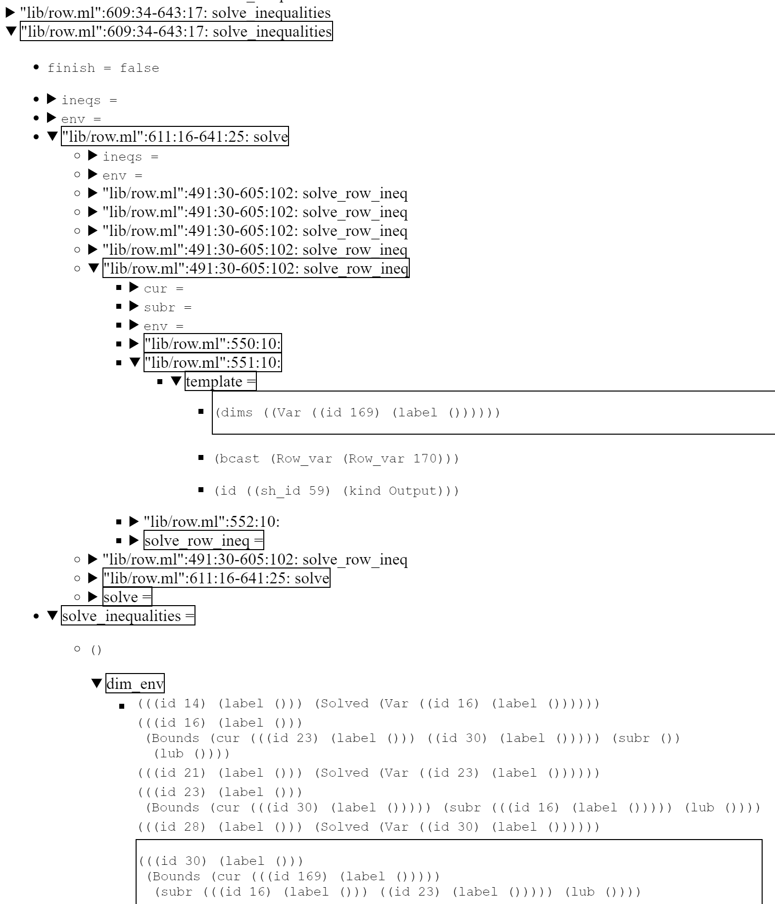
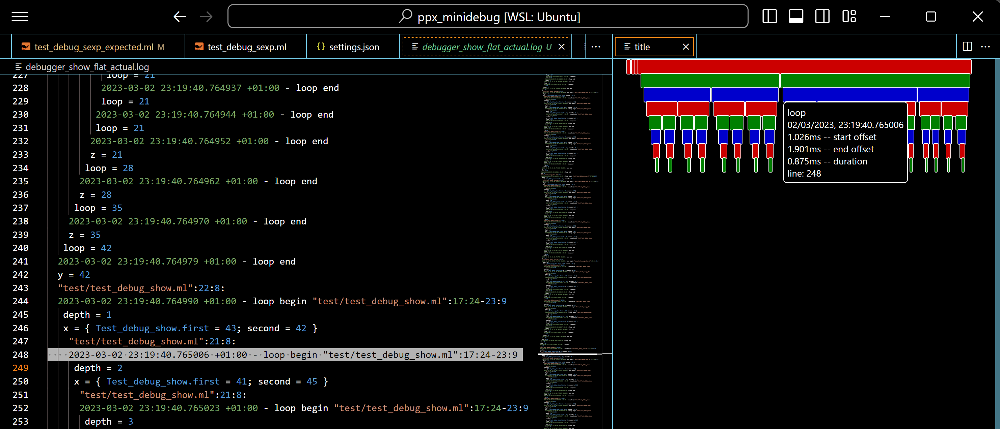

# ppx_minidebug

## `ppx_minidebug`: Debug logs for selected functions and let-bindings

`ppx_minidebug` traces selected code if it has type annotations. `ppx_minidebug` offers three ways of instrumenting the code: `%debug_pp` and `%debug_show` (also `%track_pp` and `%track_show`), based on `deriving.show`, and `%debug_sexp` (also `%track_sexp`) based on `sexplib0` and `ppx_sexp_conv`. The syntax extension expects a module `Debug_runtime` in the scope. The `ppx_minidebug.runtime` library (part of the `ppx_minidebug` package) offers three ways of logging the traces, as functors generating `Debug_runtime` modules given an output channel (e.g. for a file).

Take a look at [`ppx_debug`](https://github.com/dariusf/ppx_debug) which has complementary strengths!

See also [the generated documentation](https://lukstafi.github.io/ppx_minidebug/).

Try `opam install ppx_minidebug` to install from the opam repository. To install `ppx_minidebug` from sources, download it with e.g. `gh repo clone lukstafi/ppx_minidebug; cd ppx_minidebug` and then either `dune install` or `opam install .`.

To use `ppx_minidebug` in a Dune project, add/modify these stanzas: `(preprocess (pps ... ppx_minidebug))`, and `(libraries ... ppx_minidebug.runtime)`.

### `Pp_format`-based traces -- more bare-bones

This backend relies on the `Format` module from the standard library. Define a `Debug_runtime` using the `Pp_format` functor. The helper functor `Debug_ch` opens a file for appending.
E.g. either `module Debug_runtime = Minidebug_runtime.Pp_format(struct let debug_ch = stdout let time_tagged = true end)`, or:

```ocaml
module Debug_runtime =
  Minidebug_runtime.Pp_format((val Minidebug_runtime.debug_ch "path/to/debugger_format.log"))
```

The logged traces will be indented using OCaml's `Format` module. Truncated example (using `%debug_pp`):

```shell
BEGIN DEBUG SESSION
"test/test_debug_pp.ml":7:17-9:14: bar
x = { Test_debug_pp.first = 7; second = 42 }  "test/test_debug_pp.ml":8:6: y y = 8  bar = 336  
"test/test_debug_pp.ml":13:17-15:20: baz
x = { Test_debug_pp.first = 7; second = 42 }  "test/test_debug_pp.ml":14:36: _yz
  _yz = { Test_debug_pp.first = 8; second = 3 }  baz = 339  
"test/test_debug_pp.ml":19:22-25:9: loop
depth = 0  x = { Test_debug_pp.first = 7; second = 42 }  "test/test_debug_pp.ml":23:8: y
  "test/test_debug_pp.ml":19:22-25:9: loop
    depth = 1  x = { Test_debug_pp.first = 41; second = 9 }  "test/test_debug_pp.ml":23:8: y
      "test/test_debug_pp.ml":19:22-25:9: loop
        depth = 2  x = { Test_debug_pp.first = 8; second = 43 }  "test/test_debug_pp.ml":23:8: y
          "test/test_debug_pp.ml":19:22-25:9: loop
            depth = 3  x = { Test_debug_pp.first = 42; second = 10 } 
```

### `PrintBox`-based traces -- full feature set

This runtime relies on the `printbox` library; it has the most features.
Here we define a `Debug_runtime` either using the entrypoint `module Debug_runtime = (val Minidebug_runtime.debug ())`,
or using the `PrintBox` functor, e.g.:

```ocaml
module Debug_runtime =
  Minidebug_runtime.PrintBox((val Minidebug_runtime.debug_ch "path/to/debugger_printbox.log" end))
```

The logged traces will be pretty-printed as trees using the `printbox` package. Truncated example (using `%debug_sexp`):

```shell
BEGIN DEBUG SESSION
"test/test_debug_sexp.ml":7:19-9:17: foo
├─x = 7
├─"test/test_debug_sexp.ml":8:6: y
│ └─y = 8
└─foo = (7 8 16)
"test/test_debug_sexp.ml":15:19-17:14: bar
├─x = ((first 7) (second 42))
├─"test/test_debug_sexp.ml":16:6: y
│ └─y = 8
└─bar = 336
"test/test_debug_sexp.ml":21:19-24:28: baz
├─x = ((first 7) (second 42))
├─"test/test_debug_sexp.ml":22:17: _yz
│ └─_yz = (8 3)
├─"test/test_debug_sexp.ml":23:17: _uw
│ └─_uw = (7 13)
└─baz = 359
"test/test_debug_sexp.ml":28:19-30:17: lab
├─x = 7
├─"test/test_debug_sexp.ml":29:6: y
│ └─y = 8
└─lab = (7 8 16)
"test/test_debug_sexp.ml":34:24-40:9: loop
├─depth = 0
├─x = ((first 7) (second 42))
├─"test/test_debug_sexp.ml":38:8: y
│ ├─"test/test_debug_sexp.ml":34:24-40:9: loop
│ │ ├─depth = 1
│ │ ├─x = ((first 41) (second 9))
│ │ ├─"test/test_debug_sexp.ml":38:8: y
│ │ │ ├─"test/test_debug_sexp.ml":34:24-40:9: loop
│ │ │ │ ├─depth = 2
│ │ │ │ ├─x = ((first 8) (second 43))
│ │ │ │ ├─"test/test_debug_sexp.ml":34:24-40:9: loop
│ │ │ │ │ ├─depth = 3
│ │ │ │ │ ├─x = ((first 44) (second 4))
│ │ │ │ │ ├─"test/test_debug_sexp.ml":34:24-40:9: loop
│ │ │ │ │ │ ├─depth = 4
│ │ │ │ │ │ ├─x = ((first 5) (second 22))
│ │ │ │ │ │ ├─"test/test_debug_sexp.ml":34:24-40:9: loop
│ │ │ │ │ │ │ ├─depth = 5
│ │ │ │ │ │ │ ├─x = ((first 23) (second 2))
│ │ │ │ │ │ │ └─loop = 25
```

This runtime also allows disabling the logging of specified subtrees, when the output is irrelevant, would be a distraction, or the logs take up too much space.
The test suite example:

```ocaml
  let%debug_this_show rec fixpoint_changes (x: int): int =
    let z: int = (x - 1) / 2 in
    (* The call [x = 2] is not printed because it is a descendant of
       the no-debug call [x = 4]. *)
    Debug_runtime.no_debug_if (x <> 6 && x <> 2 && (z + 1) * 2 = x);
    if x <= 0 then 0 else z + fixpoint_changes (z + x / 2) in
  print_endline @@ Int.to_string @@ fixpoint_changes 7
```

leads to:

```shell
  "test/test_expect_test.ml":96:43-100:58: fixpoint_changes
  ├─x = 7
  ├─"test/test_expect_test.ml":97:8: z
  │ └─z = 3
  ├─"test/test_expect_test.ml":96:43-100:58: fixpoint_changes
  │ ├─x = 6
  │ ├─"test/test_expect_test.ml":97:8: z
  │ │ └─z = 2
  │ ├─"test/test_expect_test.ml":96:43-100:58: fixpoint_changes
  │ │ ├─x = 5
  │ │ ├─"test/test_expect_test.ml":97:8: z
  │ │ │ └─z = 2
  │ │ └─fixpoint_changes = 4
  │ └─fixpoint_changes = 6
  └─fixpoint_changes = 9
  9
```

At the "top level", there is another mechanism for disabling logging: `highlighted_roots` -- see below.

#### Traces in HTML as collapsible trees

The `PrintBox` runtime can be configured to output logs using HTML. The logs then become collapsible trees, so that you can expose only the relevant information when debugging. Example configuration:

```ocaml
module Debug_runtime =
  Minidebug_runtime.PrintBox ((val Minidebug_runtime.debug_ch "debug.html"))
let () = Debug_runtime.html_config := `Html
let () = Debug_runtime.boxify_sexp_from_size := 50
```

Here we also convert the logged `sexp` values (with at least 50 atoms) to trees. Example result:


#### Highlighting search terms

The `PrintBox` runtime also supports highlighting paths to logs that match a `highlight_terms`
regular expression. For example:


To limit the highlight noise, some log entries can be excluded from propagating the highlight status
using the `exclude_on_path` setting. To trim excessive logging while still providing all the context,
you can set `highlighted_roots:true`, which only outputs highlighted toplevel boxes.

#### `PrintBox` creating helpers with defaults: `debug` and `debug_html`

The configuration for the above example is more concisely just:

```ocaml
module Debug_runtime = (val Minidebug_runtime.debug_html ~highlight_terms:(Re.str "169") "debug.html")
```

Similarly, `debug` returns a `PrintBox` module, which by default logs to `stdout`:

```ocaml
module Debug_runtime = (val Minidebug_runtime.debug ())
```

#### Hyperlinks to source locations

The HTML output supports emitting file locations as hyperlinks. For example:

```ocaml
module Debug_runtime = (val Minidebug_runtime.debug_html ~hyperlink:"" "debug.html")
```

where `~hyperlink` is the prefix to let you tune the file path and select a browsing option. For illustration,
the prefixes I might use at the time of writing:

- `~hyperlink:"vscode://file//wsl.localhost/ubuntu23/home/lukstafi/ppx_minidebug/"`
- `~hyperlink:"https://github.com/lukstafi/ppx_minidebug/tree/main/"`

## Usage

To trace a function, you have to type-annotate the function result. To trace an argument of a traced function, or a `let`-binding, you need to type-annotate it. You can control how much gets logged by adding or removing type annotations.

Tracing only happens in explicitly marked scopes, using the extension points: `%debug_pp`, `%debug_this_pp`, `%debug_show`, `%debug_this_show` (based on printing functionality provided by `deriving.show`), `%debug_sexp`, `%debug_this_sexp` (using functionality provided by `sexplib0` and `ppx_sexp_conv`). See examples in [the test directory](test/).

The `%debug_this` variants are intended only for `let`-bindings: `let%debug_this v: t = compute value in body` will trace `v` and the type-annotated bindings and functions inside `compute value`, but it will not trace `body`.

To properly trace in concurrent settings, ensure that different threads use different log channels. For example, you can bind `Debug_runtime` locally: `let module Debug_runtime = Minidebug_runtime.Flushing(struct let debug_ch = thread_specific_ch let time_tagged = true end) in ...` In particular, when performing `dune runtest` in the `ppx_minidebug` directory, the `test_debug_n` and the `test_debug_n_expected` pairs of programs will interfere with each other, unless you adjust the log file names in them.

The `PrintBox` logs are the prettiest, I could not get the `Pp_format`-functor-based output look the way I wanted. The `Flushing` logs enable [Log Inspector (sub-millisecond)](https://marketplace.visualstudio.com/items?itemName=lukstafi.loginspector-submillisecond) flame graphs. One should be able to get other logging styles to work with `Log Inspector` by configuring its regexp patterns.

`ppx_minidebug` can be installed using `opam`. `ppx_minidebug.runtime` depends on `printbox`, `ptime`, `sexplib0`.

### Breaking infinite recursion with `max_nesting_depth` and looping with `max_num_children`; `Flushing`-based traces

The `PrintBox` and `Pp_format` backends only produce any output when a top-level log entry gets closed. This makes it harder to debug infinite loops and especially infinite recursion. The setting `max_nesting_depth` terminates a computation when the given log nesting is exceeded. For example:

```ocaml
module Debug_runtime = (val Minidebug_runtime.debug ~max_nesting_depth:5 ())

let%debug_show rec loop_exceeded (x : int) : int =
  let z : int = (x - 1) / 2 in
  if x <= 0 then 0 else z + loop_exceeded (z + (x / 2))

let () =
  try print_endline @@ Int.to_string @@ loop_exceeded 7
  with _ -> print_endline "Raised exception."
```

Similarly, `max_num_children` raises a failure when the given number of logs with the same parent is exceeded. For example:

```ocaml
module Debug_runtime = (val Minidebug_runtime.debug ~max_num_children:50 ())

let%debug_show _bar : unit =
  for i = 0 to 100 do
    let _baz : int = i * 2 in
    ()
  done
```

If that is insufficient, you can define a `Debug_runtime` using the `Flushing` functor.
E.g. either `module Debug_runtime = (val Minidebug_runtime.debug_flushing ())`, or:

```ocaml
module Debug_runtime =
  Minidebug_runtime.Flushing((val Minidebug_runtime.debug_ch "path/to/debugger_flushing.log"))
```

The logged traces are still indented, but if the values to print are multi-line, their formatting might be messy. The benefit of `Flushing` traces is that the output is flushed line-at-a-time, so no output should be lost if the traced program crashes. But in recent versions of `ppx_minidebug`, uncaught exceptions no longer break logging in the `PrintBox` and `Pp_format` runtimes. The indentation is also smaller (half of `PrintBox`). Truncated example (using `%debug_show`):

```shell
BEGIN DEBUG SESSION at time 2023-03-02 23:19:40.763950 +01:00
2023-03-02 23:19:40.763980 +01:00 - foo begin "test/test_debug_show.ml":3:19-5:15
 x = 7
 foo = [7; 8; 16]
2023-03-02 23:19:40.764000 +01:00 - foo end
2023-03-02 23:19:40.764011 +01:00 - bar begin "test/test_debug_show.ml":10:19-10:73
 x = { Test_debug_show.first = 7; second = 42 }
 bar = 336
2023-03-02 23:19:40.764028 +01:00 - bar end
2023-03-02 23:19:40.764034 +01:00 - baz begin "test/test_debug_show.ml":13:19-14:67
 x = { Test_debug_show.first = 7; second = 42 }
 baz = 339
2023-03-02 23:19:40.764048 +01:00 - baz end
2023-03-02 23:19:40.764054 +01:00 - loop begin "test/test_debug_show.ml":17:24-23:9
 depth = 0
 x = { Test_debug_show.first = 7; second = 42 }
  "test/test_debug_show.ml":21:8: 
  2023-03-02 23:19:40.764073 +01:00 - loop begin "test/test_debug_show.ml":17:24-23:9
   depth = 1
   x = { Test_debug_show.first = 41; second = 9 }
    "test/test_debug_show.ml":21:8: 
    2023-03-02 23:19:40.764094 +01:00 - loop begin "test/test_debug_show.ml":17:24-23:9
     depth = 2
     x = { Test_debug_show.first = 8; second = 43 }
      "test/test_debug_show.ml":21:8: 
      2023-03-02 23:19:40.764109 +01:00 - loop begin "test/test_debug_show.ml":17:24-23:9
       depth = 3
       x = { Test_debug_show.first = 42; second = 10 }
        "test/test_debug_show.ml":21:8: 
```

### Tracking: control flow branches, anonymous and insufficiently annotated functions

Using the `%track_`-prefix rather than `%debug_`-prefix to start a debug scope, or using the `%debug_trace` extension point inside a debug scope, enables more elaborate tracking of the execution path. It logs which `if`, `match`, `function` branch is taken. It logs the nesting and loop index of `for` loops, and the nesting of `while` loops. It logs functions even if the return type is not annotated, including anonymous functions; in particular, it logs type-annotated arguments of anonymous functions. To selectively disable these logs, use `%debug_notrace`. Note that it disables the logs on a lexical scope, not just on the annotated syntax node (e.g. a specific `if` or `match` expression).

If you get fewer logs than you expected, try converting `%debug_` to `%track_`.

For example:

```ocaml
  let%track_show track_branches (x : int) : int =
    if x < 6 then
      match%debug_notrace x with
      | 0 -> 1
      | 1 -> 0
      | _ ->
          let result : int = if x > 2 then x else ~-x in
          result
    else
      match x with
      | 6 -> 5
      | 7 -> 4
      | _ ->
          let result : int = if x < 10 then x else ~-x in
          result

  let () =
    print_endline @@ Int.to_string @@ track_branches 8;
    print_endline @@ Int.to_string @@ track_branches 3
```

gives:

```shell
BEGIN DEBUG SESSION
"test/test_expect_test.ml":415:37-429:16: track_branches
├─x = 8
├─"test/test_expect_test.ml":424:6: <if -- else branch>
│ └─"test/test_expect_test.ml":427:8: <match -- branch 2>
│   └─"test/test_expect_test.ml":428:14: result
│     ├─"test/test_expect_test.ml":428:44: <if -- then branch>
│     └─result = 8
└─track_branches = 8
8
"test/test_expect_test.ml":415:37-429:16: track_branches
├─x = 3
├─"test/test_expect_test.ml":417:6: <if -- then branch>
│ └─"test/test_expect_test.ml":421:14: result
│   └─result = 3
└─track_branches = 3
3
```

and

```ocaml
  let%track_this_show anonymous (x : int) =
    Array.fold_left ( + ) 0 @@ Array.init (x + 1) (fun (i : int) -> i)
  in
  print_endline @@ Int.to_string @@ anonymous 3
```

gives:

```shell
BEGIN DEBUG SESSION
"test/test_expect_test.ml":516:32-517:70: anonymous
├─x = 3
├─"test/test_expect_test.ml":517:50-517:70: __fun
│ └─i = 0
├─"test/test_expect_test.ml":517:50-517:70: __fun
│ └─i = 1
├─"test/test_expect_test.ml":517:50-517:70: __fun
│ └─i = 2
└─"test/test_expect_test.ml":517:50-517:70: __fun
  └─i = 3
6
```

## VS Code suggestions

### Add / remove type annotations and visit files using [VOCaml](https://marketplace.visualstudio.com/items?itemName=lukstafi.vocaml)

[VOCaml helpers for coding in OCaml](https://marketplace.visualstudio.com/items?itemName=lukstafi.vocaml) provide commands to add and remove annotations on selected bindings. They can be used to introduce logging, tune it, and cleanup afterward. It also has a command to populate the _Quick Open_ dialog with a file name and location from a line under cursor. It can be used to jump to the source code from a log file.

Note that you can add and remove type annotations using VSCode OCaml Platform's code actions, and the _Find and Transform_ suggestion below is a more flexible go-to-file solution -- so VOCaml is somewhat redundant. But, it is still valuable: (1) it annotates multiple `let`-bindings at once in a selection, and (2) it annotates the argument types and the return type of a function (as required by `ppx_debug`) when invoked on a function definition.

### Visualize the flame graph using [Log Inspector](https://marketplace.visualstudio.com/items?itemName=lukstafi.loginspector-submillisecond)

[Log Inspector (sub-millisecond)](https://marketplace.visualstudio.com/items?itemName=lukstafi.loginspector-submillisecond)'s main feature is visualizing timestamped logs as flame graphs. To invoke it in VS Code, go to a `Minidebug_runtime.Flushing`-style logs file, press `crtl+shift+P`, and execute the command "Log Inspector: Draw". Example effect:


The sub-millisecond functionality is now upstreamed to [Log Inspector](https://marketplace.visualstudio.com/items?itemName=LogInspector.loginspector).

### Go to file location using [Find and Transform](https://marketplace.visualstudio.com/items?itemName=ArturoDent.find-and-transform)

This will expand your general-purpose VS Code toolbox!

[Find and Transform](https://marketplace.visualstudio.com/items?itemName=ArturoDent.find-and-transform) is a powerful VS Code extension. I put the following in my `keybindings.json` file (command: `Open Keyboard Shortcuts (JSON)`):

```json
  {
    "key": "alt+q",
    "command": "findInCurrentFile",
    "args": {
      "description": "Open file at cursor",
      "find": "\"([^\"]+)\":([0-9]+)",
      "run": [
        "$${",
          "const pos = new vscode.Position($2, 0);",
          "const range = new vscode.Range(pos, pos);",
          "const options = {selection: range};",
          "const wsFolderUri = vscode.workspace.workspaceFolders[0].uri;",
          "const uri = await vscode.Uri.joinPath(wsFolderUri, '$1');",
          "await vscode.commands.executeCommand('vscode.open', uri, options);",
          
          // "await vscode.commands.executeCommand('workbench.action.quickOpen', `$1:$2`);",
        "}$$",
      ],
      "isRegex": true,
      "restrictFind": "line",
    }
  }
```

Then, pressing `alt+q` will go to the file directly, assuming the logs contain the full relative path.
