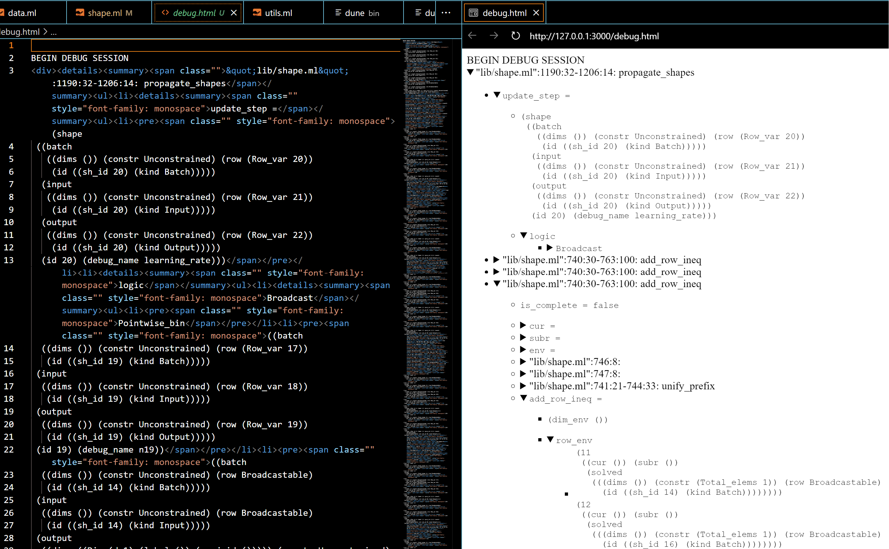
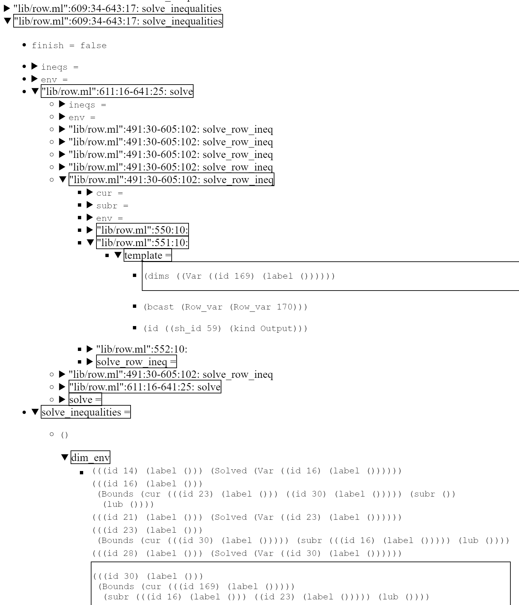
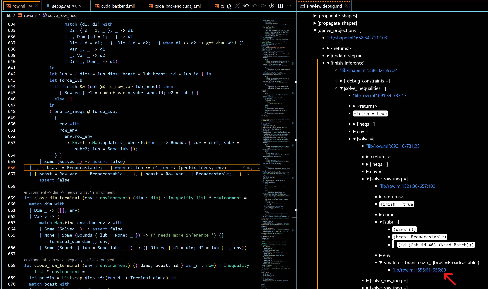
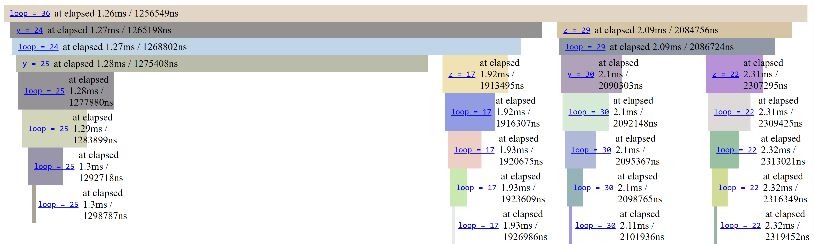

# ppx_minidebug

<!-- TOC -->

- [ppx_minidebug](#ppx_minidebug)
  - [ppx_minidebug: Debug logs for selected functions and let-bindings](#ppx_minidebug-debug-logs-for-selected-functions-and-let-bindings)
    - [Traces in HTML or Markdown as collapsible trees](#traces-in-html-or-markdown-as-collapsible-trees)
    - [Highlighting search terms](#highlighting-search-terms)
    - [Highlighting differences between runs](#highlighting-differences-between-runs)
    - [Overview of runtime creating helpers](#overview-of-runtime-creating-helpers)
  - [Usage](#usage)
    - [Breaking infinite recursion with max_nesting_depth and looping with max_num_children](#breaking-infinite-recursion-with-max_nesting_depth-and-looping-with-max_num_children)
    - [Tracking: control flow branches, anonymous and insufficiently annotated functions](#tracking-control-flow-branches-anonymous-and-insufficiently-annotated-functions)
    - [Using as a logging framework](#using-as-a-logging-framework)
      - [Specifying the level to log at via a runtime expression](#specifying-the-level-to-log-at-via-a-runtime-expression)
    - [Lexical scopes vs. dynamic scopes](#lexical-scopes-vs-dynamic-scopes)
    - [Reducing the size of generated logs](#reducing-the-size-of-generated-logs)
      - [Path filtering](#path-filtering)
      - [Dynamic subtree filtering](#dynamic-subtree-filtering)
    - [Navigating large logs](#navigating-large-logs)
    - [Providing the necessary type information](#providing-the-necessary-type-information)
    - [Dealing with concurrent execution](#dealing-with-concurrent-execution)

<!-- /TOC -->

ppx_minidebug 3.0.0 is a major release that introduces a new database backend, replacing the previous backends based on static HTML or text files. See [ppx_minidebug 2.4.0](https://ocaml.org/p/ppx_minidebug/2.4.0) ([2.4.x-static-artifacts branch](https://github.com/lukstafi/ppx_minidebug/tree/2.4.x-static-artifacts)) -- if the artifacts it generates for your use case are not too large, it will offer more features until the 3.x rewrite matures.


## `ppx_minidebug`: Debug logs for selected functions and let-bindings

`ppx_minidebug` traces let bindings and functions within a selected scope if they have type annotations. `ppx_minidebug` offers three ways of instrumenting the code: `%debug_pp` and `%debug_show` (also `%track_pp`, `%diagn_pp` and `%track_show`, `%diagn_show`), based on `deriving.show`, and `%debug_sexp` (also `%track_sexp`, `%diagn_sexp`) based on `sexplib0` and `ppx_sexp_conv`. Explicit logs can be added with `%log` within a debug scope (`%log` is not a registered extension point to avoid conflicts with other logging frameworks). The syntax extension expects a function `_get_local_debug_runtime` in the scope (or a module `Debug_runtime` for extension points `_o_` e.g. `%debug_o_sexp`). The `ppx_minidebug.runtime` library (part of the `ppx_minidebug` package) offers multiple ways of logging the traces, as helper functions generating `Debug_runtime` modules. See [the generated documentation for `Minidebug_runtime`](https://lukstafi.github.io/ppx_minidebug/ppx_minidebug/Minidebug_runtime/index.html).

Take a look at [`ppx_debug`](https://github.com/dariusf/ppx_debug) which has complementary strengths!

Try `opam install ppx_minidebug` to install from the opam repository. To install the development version of `ppx_minidebug`, download it with e.g. `gh repo clone lukstafi/ppx_minidebug; cd ppx_minidebug` and then `dune build; opam install .`.

To use `ppx_minidebug` in a Dune project, add/modify these stanzas: `(preprocess (pps ... ppx_minidebug))`, and `(libraries ... ppx_minidebug.runtime)`.

We can introduce `ppx_minidebug` runtimes in a project in multiple ways, but the most convenient is via the functions `local_runtime`, `local_runtime_flushing`, `prefixed_runtime`, `prefixed_runtime_flushing`.

<!-- $MDX file=doc/sync_to_md.ml,part=introduction -->
```ocaml
let _get_local_debug_runtime = Minidebug_runtime.local_runtime "sync_to_md-introduction"
let%debug_sexp rec foo : int list -> int = function [] -> 0 | x :: xs -> x + foo xs
let (_ : int) = foo [ 1; 2; 3 ]
```

The logged traces will be pretty-printed as trees using the `printbox` package. This produces:

<!-- $MDX file=doc/sync_to_md-introduction.log -->
```
BEGIN DEBUG SESSION 
foo = 6
├─"doc/sync_to_md.ml":5:73
├─<function -- branch 1> :: (x, xs)
├─x = 1
├─xs = (2 3)
└─foo = 5
  ├─"doc/sync_to_md.ml":5:73
  ├─<function -- branch 1> :: (x, xs)
  ├─x = 2
  ├─xs = 3
  └─foo = 3
    ├─"doc/sync_to_md.ml":5:73
    ├─<function -- branch 1> :: (x, xs)
    ├─x = 3
    ├─xs
    └─foo = 0
      ├─"doc/sync_to_md.ml":5:58
      └─<function -- branch 0> []
```

### Traces in HTML or Markdown as collapsible trees

The `PrintBox` runtime can be configured to output logs using HTML or Markdown. The logs then become collapsible trees, so that you can expose only the relevant information when debugging. Example:

<!-- $MDX file=doc/sync_to_md.ml,part=simple_html -->
```ocaml
let _get_local_debug_runtime =
  Minidebug_runtime.local_runtime ~backend:(`Html Minidebug_runtime.default_html_config)
    "sync_to_md-simple_html"

let%debug_sexp rec foo : int list -> int = function [] -> 0 | x :: xs -> x + foo xs
let (_ : int) = foo [ 1; 2; 3 ]
```

This produces:

<!-- $MDX file=doc/sync_to_md-simple_html.html -->
```
BEGIN DEBUG SESSION 
<div><details><summary><span><span><span><a id="1"></a></span>&nbsp;<span><span style="font-family: monospace">foo = 6</span></span></span></span></summary><ul><li><div>&quot;doc/sync_to_md.ml&quot;:14:73</div></li><li><table class="non-framed"><tr><td><a id="1"></a></td><td><div>&lt;function -- branch 1&gt; :: (x, xs)</div></td></tr></table></li><li><pre style="font-family: monospace">x = 1</pre></li><li><pre style="font-family: monospace">xs = (2 3)</pre></li><li><details><summary><span><span><span><a id="2"></a></span>&nbsp;<span><span style="font-family: monospace">foo = 5</span></span></span></span></summary><ul><li><div>&quot;doc/sync_to_md.ml&quot;:14:73</div></li><li><table class="non-framed"><tr><td><a id="2"></a></td><td><div>&lt;function -- branch 1&gt; :: (x, xs)</div></td></tr></table></li><li><pre style="font-family: monospace">x = 2</pre></li><li><pre style="font-family: monospace">xs = 3</pre></li><li><details><summary><span><span><span><a id="3"></a></span>&nbsp;<span><span style="font-family: monospace">foo = 3</span></span></span></span></summary><ul><li><div>&quot;doc/sync_to_md.ml&quot;:14:73</div></li><li><table class="non-framed"><tr><td><a id="3"></a></td><td><div>&lt;function -- branch 1&gt; :: (x, xs)</div></td></tr></table></li><li><pre style="font-family: monospace">x = 3</pre></li><li><div>xs</div></li><li><details><summary><span><span><span><a id="4"></a></span>&nbsp;<span><span style="font-family: monospace">foo = 0</span></span></span></span></summary><ul><li><div>&quot;doc/sync_to_md.ml&quot;:14:58</div></li><li><table class="non-framed"><tr><td><a id="4"></a></td><td><div>&lt;function -- branch 0&gt; []</div></td></tr></table></li></ul></details></li></ul></details></li></ul></details></li></ul></details></div>
```

The backend will also convert the logged `sexp` values (with at least [boxify_sexp_from_size] atoms, default is 50) to trees. Example result:


### Highlighting search terms

The `PrintBox` runtime also supports highlighting paths to logs that match a `highlight_terms`
regular expression. For example:


To limit the highlight noise, some log entries can be excluded from propagating the highlight status
using the `exclude_on_path` setting. To trim excessive logging while still providing some context,
you can set `prune_upto` to a level greater than 0, which only outputs highlighted boxes below that level.

### Highlighting differences between runs

The `PrintBox` runtime can highlight differences between the current run and a previous run's logs. This is useful for understanding how program behavior changes between executions. To enable this feature, provide the `prev_run_file` argument when creating the runtime. It should be the "raw" messages file of the previous run, including the `.raw` suffix:

<!-- $MDX file=doc/sync_to_md.ml,part=highlight_diffs -->
```ocaml
let _get_local_debug_runtime =
  Minidebug_runtime.local_runtime ~prev_run_file:"sync_to_md-introduction.raw"
    "sync_to_md-highlight_diffs"

let%debug_sexp rec foo : int list -> int = function [] -> 0 | x :: xs -> x + foo xs
let (_ : int) = foo [ 1; 5; 3; 4 ]
```

This produces:

<!-- $MDX file=doc/sync_to_md-highlight_diffs.log -->
```
BEGIN DEBUG SESSION 
┌───────────────────────────────┐Changed from: xs = (2 3)
│┌────────┐Changed from: foo = 6│
││foo = 13│                     │
│└────────┘                     │
├───────────────────────────────┘
├─"doc/sync_to_md.ml":23:73
├─┬─────────────────────────────────┐Changed from: xs = (2 3)
│ │<function -- branch 1> :: (x, xs)│
│ └─────────────────────────────────┘
├─x = 1
├─┬────────────┐Changed from: xs = (2 3)
│ │xs = (5 3 4)│
│ └────────────┘
└─┬─────────────────────────────────┐Changed from: x = 2
  │┌────────┐Inserted in current run│
  ││foo = 12│                       │
  │└────────┘                       │
  ├─────────────────────────────────┘
  ├─"doc/sync_to_md.ml":23:73
  ├─┬─────────────────────────────────┐Changed from: x = 2
  │ │<function -- branch 1> :: (x, xs)│
  │ └─────────────────────────────────┘
  ├─┬─────┐Changed from: x = 2
  │ │x = 5│
  │ └─────┘
  ├─┬──────────┐Changed from: xs = 3
  │ │xs = (3 4)│
  │ └──────────┘
  └─┬──────────────────────────────┐Inserted in current run
    │┌───────┐Changed from: foo = 5│
    ││foo = 7│                     │
    │└───────┘                     │
    ├──────────────────────────────┘
    ├─"doc/sync_to_md.ml":23:73
    ├─┬─────────────────────────────────┐Inserted in current run
    │ │<function -- branch 1> :: (x, xs)│
    │ └─────────────────────────────────┘
    ├─x = 3
    ├─┬──────┐Inserted in current run
    │ │xs = 4│
    │ └──────┘
    └─┬──────────────────────────────┐Inserted in current run
      │┌───────┐Changed from: foo = 3│
      ││foo = 4│                     │
      │└───────┘                     │
      ├──────────────────────────────┘
      ├─"doc/sync_to_md.ml":23:73
      ├─┬─────────────────────────────────┐Inserted in current run
      │ │<function -- branch 1> :: (x, xs)│
      │ └─────────────────────────────────┘
      ├─┬─────┐Inserted in current run
      │ │x = 4│
      │ └─────┘
      ├─xs
      └─foo = 0
        ├─"doc/sync_to_md.ml":23:58
        └─<function -- branch 0> []
```

The highlighting of differences works independently from (and can be combined with) search term highlighting. The runtime will highlight entries that do not have a corresponding entry in the previous run: currently, deletions (previous run entries missing in the current run) do not affect the highlighting. Highlights comming from diffing runs are annotated with the diff reason (change or insertion). For a block-level highlight, the attached reason comes from the first diff encountered in the block. The ignore patterns are erased in the reason strings.

Note that the comparison is performed at the chunk level, where each chunk is a complete toplevel log tree. The log trees must match exactly: insertions and deletions of toplevel log trees are not supported. This limitation helps keep the comparison efficient but means you might have to coarsen the granularity of the log trees to get useful differences.

The `diff_ignore_pattern` setting can be used to ignore certain patterns in the logs. For example in the test suite, ignoring message-level timestamps:


Note that the timestamps of the log entries are not treated as messages, so are necessarily ignored.

For efficiency, the minimal edit distance search is limited, roughly speaking, to a band around the diagonal / greedy best match / forced match. The setting `max_distance_factor` controls the width of the band. (The implementation tweaks that heuristic somewhat to account for the tree structure.)

You can force aligning certain entry IDs via the setting `entry_id_pairs`. The previous run's entry IDs come first in the pairs. See the example [test/debug_diffs_align.ml](test/debug_diffs_align.ml):

<!-- $MDX file=test/debug_diffs_align.ml,part=align_entry_ids -->
```ocaml
  let _get_local_debug_runtime =
    Minidebug_runtime.local_runtime ~values_first_mode:false ~print_entry_ids:true
      ~backend:`Text ~prev_run_file:(prev_run ^ ".raw")
      ~entry_id_pairs:[ (2, 4); (8, 6) ]
        (* Force mappings: - Entry 2 (early prev) to Entry 4 (middle curr) - Entry 8 (late
           prev) to Entry 6 (in the shorter curr) *)
      curr_run
  in
```

### Overview of runtime creating helpers

Binding `_get_local_debug_runtime` to a result of the `_runtime` functions is the suggested way of providing debug runtimes, since it is aware of multithreaded contexts. The `local_` functions log to different files from different threads, while the `prefixed_` functions log to the single channel `debug_ch`, and by default to standard output. The `_flushing` functions have limited functionality (don't use PrintBox) but output messages immediately.


When logging uses sexps and boxification, and the result is decomposed into a subtree, only the header of the result subtree is put in the header line, and the rest of the result subtree is just underneath it with a `<returns>` or a `<values>` header. Example showcasing the `printbox-html` backend:


Example showcasing the `printbox-md` (Markdown) backend:


## Usage

Tracing only happens in explicitly marked lexical scopes. For extension points applied directly to bindings (let-definitions) only the `let` definition in scope for logging, the body of the definition(s) is considered outside the extension point. (But if the extension is over an expression with a nested let-binding, the body of the definition is in the scope of the extension.)

The entry extension points vary along three axes:

- `%debug_` vs. `%track_` vs. `%diagn_`
  - The prefix `%debug_` means logging fewer things: only let-bound values and functions are logged, and functions only when either: directly in a `%debug_`-annotated let binding, or their return type is annotated.
  - `%track_` also logs: which `if`, `match`, `function` branch is taken, `for` and `while` loops, and all functions, including anonymous ones.
  - The prefix `%diagn_` means only generating logs for explicitly logged values, i.e. introduced by `[%log ...]`, `[%log_result ...]`, `[%log_printbox ...]` statements.
- Optional infixes `_rt_` and `_o_`, and the default "no-infix" behavior:
  - `_rt_` adds a first-class module argument to a function, and unpacks it as `module Debug_runtime` for the scope of the function.
  - `_o_` uses an existing `Debug_runtime` module from the scope instead of calling `_get_local_debug_runtime`
  - without any infix, the runtime is unpacked within the scope of each function: `let module Debug_runtime = (val _get_local_debug_runtime ()) in ...`.
  - Both the `_rt_` and the default (no-infix) functionality is "one use only": it applies only to the function the extension point is attached to.
- Representation and printing mechanism: `_pp`, `_show`, recommended: `_sexp`
  - `_pp` is currently most restrictive as it requires the type of a value to be an identifier. The identifier is converted to a `pp_` printing function, e.g. `pp_int`.
  - `_show` converts values to strings via the `%show` extension provided by `deriving.show`: e.g. `[%show: int list]`.
  - `_sexp` converts values to sexp expressions first using `%sexp_of`, e.g. `[%sexp_of: int list]`. The runtime can decide how to print the sexp expressions. The `PrintBox` backend allows to convert the sexps to box structures first, with the `boxify_sexp_from_size` setting. This means large values can be unfolded gradually for inspection.

Plus, there are non-entry extension points `%log`, `%log_printbox` and `%log_result` for logging values. They are not registered, which as a side effect should somewhat mitigate conflicts with other ppx extensions for logging. There's also an un-registered extension points `%log_entry` and `%log_block` for opening a log subtree; `%log_entry` is for arbitrary computations whereas `%log_block`'s body is for logging purposes only.

See examples in [the test directory](test/), and especially [the inline tests](test/test_expect_test.ml).

Only type-annotated let-bindings, function arguments, function results can be implicitly logged. However, the bindings and function arguments can be nested patterns with only parts of them type-annotated! The explicit loggers `%log` and `%log_result` take a value and reconstruct its type from partial type annotations (deconstructing the expression), sometimes assuming unknown types are strings. The `%log_printbox` logger takes a `PrintBox.t` value. The `%log_entry` and `%log_block` loggers takes a string value for the header of the log subtree.

To properly trace in concurrent settings, ensure that different threads use different log channels. For example, you can manually bind `Debug_runtime` locally: `let module Debug_runtime = Minidebug_runtime.debug_file thread_name in ...` and use extension points `_o_` infixed. To facilitate that, the default (non-infix) behavior is to open locally a runtime returned by `_get_local_debug_runtime`, but note that this only happens inside the functions annotated by ppx_minidebug entry points (not in nested un-annotated functions). Extension points with the `_rt_` infixes can help where more fine-grained or declarative control is needed, e.g. with fibers for cooperative multithreading. See [Dealing with concurrent execution](#dealing-with-concurrent-execution) for more.

To ensure that log files are properly closed, you can use `Minidebug_runtime.finish_and_cleanup` at the end. This is typically not needed (and is more helpful on Windows, where a log file might remain locked after a process exits without closing it).

`ppx_minidebug` can be installed using `opam`. `ppx_minidebug.runtime` depends on `printbox`, `ptime`, `mtime`, `sexplib0`.

### Breaking infinite recursion with `max_nesting_depth` and looping with `max_num_children`

The setting `max_nesting_depth` terminates a computation when the given log nesting is exceeded. For example:

<!-- $MDX file=test/test_expect_test.ml,part=debug_interrupts -->
```ocaml
  let%debug_show rec loop_exceeded (x : int) : int =
    [%debug_interrupts
      { max_nesting_depth = 5; max_num_children = 1000 };
      let z : int = (x - 1) / 2 in
      if x <= 0 then 0 else z + loop_exceeded (z + (x / 2))]
  in
  let () =
    try print_endline @@ Int.to_string @@ loop_exceeded 7
    with _ -> print_endline "Raised exception."
  in
  let db = Minidebug_client.Client.open_db db_file in
  Minidebug_client.Client.show_trace db ~values_first_mode:false run_id;
  [%expect
    {|
    Raised exception.
    [debug] loop_exceeded @ test/test_expect_test.ml:260:35-264:60
      x = 7
      [debug] z @ test/test_expect_test.ml:263:10-263:11
        z => 3
      [debug] loop_exceeded @ test/test_expect_test.ml:260:35-264:60
        x = 6
        [debug] z @ test/test_expect_test.ml:263:10-263:11
          z => 2
        [debug] loop_exceeded @ test/test_expect_test.ml:260:35-264:60
          x = 5
          [debug] z @ test/test_expect_test.ml:263:10-263:11
            z => 2
          [debug] loop_exceeded @ test/test_expect_test.ml:260:35-264:60
            x = 4
            [debug] z @ test/test_expect_test.ml:263:10-263:11
              z => 1
            [debug] loop_exceeded @ test/test_expect_test.ml:260:35-264:60
              x = 3
              [debug] z @ test/test_expect_test.ml:263:10-263:11
                z => 1
              [debug] loop_exceeded @ test/test_expect_test.ml:260:35-264:60
                x = 2
                [debug] z @ test/test_expect_test.ml:263:10-263:11
                  z = <max_nesting_depth exceeded>
    |}]
```

Similarly, `max_num_children` raises a failure when the given number of logs with the same parent is exceeded. For example:

<!-- $MDX file=test/test_expect_test.ml,part=debug_limit_children -->
```ocaml
  let () =
    try
      let%debug_show _bar : unit =
        [%debug_interrupts
          { max_nesting_depth = 1000; max_num_children = 10 };
          for i = 0 to 100 do
            let _baz : int = i * 2 in
            ()
          done]
      in
      ()
    with Failure s -> print_endline @@ "Raised exception: " ^ s
  in
  let db = Minidebug_client.Client.open_db db_file in
  Minidebug_client.Client.show_trace db ~values_first_mode:false run_id;
  [%expect
    {|
    Raised exception: ppx_minidebug: max_num_children exceeded
    [debug] _bar @ test/test_expect_test.ml:311:21-311:25
      [debug] _baz @ test/test_expect_test.ml:315:16-315:20
        _baz => 0
      [debug] _baz @ test/test_expect_test.ml:315:16-315:20
        _baz => 2
      [debug] _baz @ test/test_expect_test.ml:315:16-315:20
        _baz => 4
      [debug] _baz @ test/test_expect_test.ml:315:16-315:20
        _baz => 6
      [debug] _baz @ test/test_expect_test.ml:315:16-315:20
        _baz => 8
      [debug] _baz @ test/test_expect_test.ml:315:16-315:20
        _baz => 10
      [debug] _baz @ test/test_expect_test.ml:315:16-315:20
        _baz => 12
      [debug] _baz @ test/test_expect_test.ml:315:16-315:20
        _baz => 14
      [debug] _baz @ test/test_expect_test.ml:315:16-315:20
        _baz => 16
      [debug] _baz @ test/test_expect_test.ml:315:16-315:20
        _baz => 18
      [debug] _baz @ test/test_expect_test.ml:315:16-315:20
        _baz => 20
      [debug] _baz @ test/test_expect_test.ml:315:16-315:20
        _baz = <max_num_children exceeded>
    |}]
```

The `%debug_interrupts` extension point emits the interrupt checks in a lexically delimited scope. For convenience, we offer the extension point `%global_debug_interrupts` which triggers emitting the interrupt checks in the remainder of the source preprocessed in the same process (its scope is therefore less well defined). For example:

<!-- $MDX file=test/test_debug_interrupts.ml,part=global_debug_interrupts -->
```ocaml
let _get_local_debug_runtime =
  let rt = Minidebug_db.debug_db_file "debugger_interrupts" in
  fun () -> rt

[%%global_debug_interrupts { max_nesting_depth = 5; max_num_children = 10 }]
[%%global_debug_type_info true]

let%debug_show rec loop_exceeded (x : int) : int =
  let z : int = (x - 1) / 2 in
  if x <= 0 then 0 else z + loop_exceeded (z + (x / 2))
```

Since starting with ppx_minidebug 3.0 we stream logs to a database, this functionality is much less useful -- the growing log tree can be queried while the program is still running.

### Tracking: control flow branches, anonymous and insufficiently annotated functions

Using the `%track_`-prefix rather than `%debug_`-prefix to start a debug scope, or using the `%debug_trace` extension point inside a debug scope, enables more elaborate tracking of the execution path. It logs which `if`, `match`, `function` branch is taken. It logs the nesting and loop index of `for` loops, and the nesting of `while` loops. It logs functions even if the return type is not annotated, including anonymous functions; in particular, it logs type-annotated arguments of anonymous functions. To selectively disable these logs, use `%debug_notrace`. Note that it disables the logs on a lexical scope, not just on the annotated syntax node (e.g. a specific `if` or `match` expression).

If you get fewer logs than you expected, try converting `%debug_` to `%track_`.

Example that also illustrates disabling tracing:


<!-- $MDX file=test/test_expect_test.ml,part=track_notrace_example -->
```ocaml
  let%track_show track_branches (x : int) : int =
    if x < 6 then
      match%debug_notrace x with
      | 0 -> 1
      | 1 -> 0
      | _ ->
          let result : int = if x > 2 then x else ~-x in
          result
    else
      match x with
      | 6 -> 5
      | 7 -> 4
      | _ ->
          let result : int = if x < 10 then x else ~-x in
          result
  in
  let () =
    try
      print_endline @@ Int.to_string @@ track_branches 8;
      print_endline @@ Int.to_string @@ track_branches 3
    with _ -> print_endline "Raised exception."
  in
  let db = Minidebug_client.Client.open_db db_file in
  Minidebug_client.Client.show_trace db ~values_first_mode:false run_id;
  [%expect
    {|
    8
    3
    [track] track_branches @ test/test_expect_test.ml:727:32-741:16
      x = 8
      [track] else:test_expect_test:736 @ test/test_expect_test.ml:736:6-741:16
        [track] <match -- branch 2> @ test/test_expect_test.ml:740:10-741:16
          [track] result @ test/test_expect_test.ml:740:14-740:20
            [track] then:test_expect_test:740 @ test/test_expect_test.ml:740:44-740:45
            result => 8
      track_branches => 8
    [track] track_branches @ test/test_expect_test.ml:727:32-741:16
      x = 3
      [track] then:test_expect_test:729 @ test/test_expect_test.ml:729:6-734:16
        [debug] result @ test/test_expect_test.ml:733:14-733:20
          result => 3
      track_branches => 3
    |}]
```

Another example:

<!-- $MDX file=test/test_expect_test.ml,part=track_anonymous_example -->
```ocaml
  let%track_show anonymous (x : int) =
    Array.fold_left ( + ) 0 @@ Array.init (x + 1) (fun (i : int) -> i)
  in
  let () =
    try print_endline @@ Int.to_string @@ anonymous 3
    with Failure s -> print_endline @@ "Raised exception: " ^ s
  in
  let db = Minidebug_client.Client.open_db db_file in
  Minidebug_client.Client.show_trace db ~values_first_mode:false run_id;
  [%expect
    {|
    6
    [track] anonymous @ test/test_expect_test.ml:940:27-941:70
      x = 3
      [track] fun:test_expect_test:941 @ test/test_expect_test.ml:941:50-941:70
        i = 0
      [track] fun:test_expect_test:941 @ test/test_expect_test.ml:941:50-941:70
        i = 1
      [track] fun:test_expect_test:941 @ test/test_expect_test.ml:941:50-941:70
        i = 2
      [track] fun:test_expect_test:941 @ test/test_expect_test.ml:941:50-941:70
        i = 3
    |}]
```

To disable, rather than enhance, debugging for a piece of code, you can use the `%diagn_` extension points.

Explicit logging statements also help with tracking the execution, since they can be placed anywhere within a debug scope. Example from the test suite:

<!-- $MDX file=test/test_expect_test.ml,part=track_while_loop_example -->
```ocaml
  let _get_local_debug_runtime =
    let rt = Minidebug_db.debug_db_file db_file in
    fun () -> rt
  in
  let%track_sexp result =
    let i = ref 0 in
    let j = ref 0 in
    while !i < 6 do
      [%log 1, "i=", (!i : int)];
      incr i;
      [%log 2, "i=", (!i : int)];
      j := !j + !i;
      [%log 3, "j=", (!j : int)]
    done;
    !j
  in
  let () = print_endline @@ Int.to_string result in
  let db = Minidebug_client.Client.open_db db_file in
  Minidebug_client.Client.show_trace db run_id;
  [%expect
    {|
    21
    [track] result @ test/test_expect_test.ml:1959:17-1959:23
      [track] while:test_expect_test:1962 @ test/test_expect_test.ml:1962:4-1968:8
        [track] <while loop> @ test/test_expect_test.ml:1963:6-1967:32
          (1 i= 0)
          (2 i= 1)
          (3 j= 1)
        [track] <while loop> @ test/test_expect_test.ml:1963:6-1967:32
          (1 i= 1)
          (2 i= 2)
          (3 j= 3)
        [track] <while loop> @ test/test_expect_test.ml:1963:6-1967:32
          (1 i= 2)
          (2 i= 3)
          (3 j= 6)
        [track] <while loop> @ test/test_expect_test.ml:1963:6-1967:32
          (1 i= 3)
          (2 i= 4)
          (3 j= 10)
        [track] <while loop> @ test/test_expect_test.ml:1963:6-1967:32
          (1 i= 4)
          (2 i= 5)
          (3 j= 15)
        [track] <while loop> @ test/test_expect_test.ml:1963:6-1967:32
          (1 i= 5)
          (2 i= 6)
          (3 j= 21)
    |}]
```

### Using as a logging framework

`ppx_minidebug` can be used as a logging framework: its annotations can be stored permamently with the source code, rather than shyly added for a brief period of debugging. To allow this, there needs to be a mechanism of logging levels -- otherwise the system is slowed down too much, or even if performance is not an issue, the user is overwhelmed with the amount of logs. `ppx_minidebug` addresses these issues in a flexible way, by offering restriction of log levels both at compile time and at runtime.

The `%diagn_` extension points (short for "diagnostic") are tailored for the "logging framework" use-case. Within the scope of a `%diagn_` extension point, only explicit logs are generated. Therefore, one can freely add type annotations without generating debug logs. As a side-effect, `%diagn_` annotations can be used to disable debugging for pieces of code where we need type annotations for code reasons, but do not have serialization/printing functions for the types.

In the `PrintBox` backend, logs accumulate until the current toplevel log scope is closed. This is unfortunate in the logging framework context, where promptly informing the user using the logs might be important. To remedy this, `PrintBox_runtime` offers the setting `snapshot_every_sec`. When set, if sufficient time has passed since the last output, the backend will output the whole current toplevel log scope. If possible, the previous snapshot of the same log scope is erased, to not duplicate information. The underlying mechanism is available as [snapshot] in the generic interface; it does nothing in the flushing backend. [snapshot] is useful when there's a risk of a "premature" exit of the debugged program or thread.

The log levels are integers intended to be within the range 0-9, where 0 means no logging at all. They can be provided explicitly by all extension entry points and all explicit logging extensions. When omitted, the log level of the enclosing log entry is used; the default for a top-level log entry is log level 1. The syntax for logging at a compile-time given level is by example: `%debug2_sexp` (log at level 2), `%log3` (log at level 3), `%log1_resut` (log result at level 1), `%diagn3_sexp` (log at level 3) etc.

The `%diagn_` extension points further restrict logging to explicit logs only. Example from the test suite:

<!-- $MDX file=test/test_expect_test.ml,part=diagn_show_ignores_bindings -->
```ocaml
  let run_id = next_run () in
  let _get_local_debug_runtime =
    let rt = Minidebug_db.debug_db_file db_file in
    fun () -> rt
  in
  let%diagn_show bar { first : int; second : int } : int =
    let { first : int = a; second : int = b } = { first; second = second + 3 } in
    let y : int = a + 1 in
    [%log "for bar, b-3", (b - 3 : int)];
    (b - 3) * y
  in
  let () = print_endline @@ Int.to_string @@ bar { first = 7; second = 42 } in
  let%diagn_show baz { first : int; second : int } : int =
    let foo { first : int; second : int } : int =
      [%log "foo baz, f squared", (first * first : int)];
      (first * first) + second
    in
    foo { first; second }
  in
  let () = print_endline @@ Int.to_string @@ baz { first = 7; second = 42 } in
  let db = Minidebug_client.Client.open_db db_file in
  Minidebug_client.Client.show_trace db run_id;
  [%expect
    {|
    336
    91
    [diagn] bar @ test/test_expect_test.ml:2486:21-2490:15
      ("for bar, b-3", 42)
    [diagn] baz @ test/test_expect_test.ml:2493:21-2498:25
      ("foo baz, f squared", 49)
    |}]
```

At runtime creation, the level can be set via the `~log_level` parameter, or via `Debug_runtime.log_level := ...` later on, also for the flushing backend. The following example also illustrates the `_rt_` runtime-passing entry points:

<!-- $MDX file=test/test_expect_test.ml,part=log_runtime_log_levels_while_loop_example -->
```ocaml
  let rt log_level run_name = Minidebug_db.debug_db_file ~log_level ~run_name db_file in
  let%track_rt_sexp result () : int =
    let i = ref 0 in
    let j = ref 0 in
    while !i < 6 do
      (* Intentional empty but not omitted else-branch. *)
      if !i < 2 then [%log1 "ERROR:", 1, "i=", (!i : int)] else ();
      incr i;
      [%log2 "WARNING:", 2, "i=", (!i : int)];
      j := (fun { contents } -> !j + contents) i;
      [%log3 "INFO:", 3, "j=", (!j : int)]
    done;
    !j
  in
  print_endline
  @@ Int.to_string
       (result
          (rt 9 "Everything")
          ());
  let db = Minidebug_client.Client.open_db db_file in
  Minidebug_client.Client.show_trace db (latest_run ());
  print_endline
  @@ Int.to_string
       (result
          (rt 0 "Nothing")
          ());
  let latest_run_after_nothing =
    Minidebug_client.Client.open_db db_file |>
    Minidebug_client.Client.get_latest_run |>
    Option.get in
  print_endline @@ "latest_run_after_nothing: " ^ Option.get latest_run_after_nothing.run_name;
  print_endline
  @@ Int.to_string
       (result
          (rt 1 "Error")
          ());
```

But there is a more convenient approach. Both at compile time (constant) and at runtime (integer expression), the level can be set for a scope with `%log_level`, or globally with `%global_debug_log_level`. (`%log_level` is not registered to minimize incompatibility with other logging frameworks.) The (default) compile-time level can also be set silently via the environment variable `PPX_MINIDEBUG_DEFAULT_COMPILE_LOG_LEVEL` (unsafe). The extensions `%global_debug_log_level`, `%log_level` set the compile time log level only when used with an integer literal, otherwise they are limited to setting the runtime log level.

For example:

<!-- $MDX file=test/test_debug_log_prefixed.ml,part=global_debug_log_level -->
```ocaml
let _get_local_debug_runtime =
  let rt = Minidebug_db.debug_db_file "debugger_log_prefixed" in
  fun () -> rt

[%%global_debug_log_level 2]

let%diagn_show rec loop_exceeded (x : int) : int =
  let z : int =
    [%log2 "inside loop", (x : int)];
    [%log3 "this is detail"];
    (x - 1) / 2
  in
  if x <= 0 then 0 else z + loop_exceeded (z + (x / 2))
```

This will not emit logging code that is above the stated log level. Note that the compile-time pruning of logging happens independently of the runtime log level! This gives more flexibility but can lead to confusing situations.

Currently `%log_level` adjusts the log level both in the lexical scope and the dynamic scope. These functionalities could in principle be separated.

You can set the compile time log level by setting the environment variable `PPX_MINIDEBUG_DEFAULT_COMPILE_LOG_LEVEL` -- this provides a default that will be overriden by all the other configuration options. This approach is error prone since all your projects and files will share the same configuration, and there is no consistency checking; use at your own risk. Some errors can be avoided by adding `(preprocessor_deps (env_var PPX_MINIDEBUG_DEFAULT_COMPILE_LOG_LEVEL))` in dune files.

There's also a way to compile the code adaptively, using any shell environment variable: `[%%global_debug_log_level_from_env_var "environment_variable_name"]`. The variable name is case-sensitive, the values should be integers. I recommend configuring this in every affected file, otherwise the behavior is unspecified.

With `[%%global_debug_log_level_from_env_var "environment_variable_name"]`, the generated code will check that the compile-time adaptive pruning matches the runtime value of the environment variable. If that's an obstacle, use `%%global_debug_log_level_from_env_var_unsafe` which will not perform the check. Using `%%global_debug_log_level_from_env_var_unsafe` or `PPX_MINIDEBUG_DEFAULT_COMPILE_LOG_LEVEL` can be prone to workflow bugs where different parts of a codebase are compiled with different log levels, leading to confusing behavior. In any case, I recommend adding a dependency on the environment variable to the `dune` file: for libraries, that would be `(preprocessor_deps (env_var environment_variable_name))`.

Another example from the test suite, notice how the log level of `%log1` overrides the parent log level of `%debug3_show`:

<!-- $MDX file=test/test_expect_test.ml,part=debug_show_log_level_runtime -->
```ocaml
  let run_id = next_run () in
  let _get_local_debug_runtime =
    let rt = Minidebug_db.debug_db_file ~log_level:2 db_file in
    fun () -> rt
  in
  let%debug3_show () =
    let foo { first : int; second : int } : int =
      let { first : int = a; second : int = b } = { first; second = second + 3 } in
      let y : int = a + 1 in
      [%log "for foo, b-3", (b - 3 : int)];
      (b - 3) * y
    in
    let bar { first : int; second : int } : int =
      let { first : int = a; second : int = b } = { first; second = second + 3 } in
      let y : int = a + 1 in
      [%log1 "for bar, b-3", (b - 3 : int)];
      (b - 3) * y
    in
    let%debug2_show baz { first : int; second : int } : int =
      let { first : int; second : int } = { first = first + 1; second = second + 3 } in
      [%log "for baz, f squared", (first * first : int)];
      (first * first) + second
    in
    print_endline @@ Int.to_string @@ foo { first = 7; second = 42 };
    print_endline @@ Int.to_string @@ bar { first = 7; second = 42 };
    print_endline @@ Int.to_string @@ baz { first = 7; second = 42 }
  in
  let db = Minidebug_client.Client.open_db db_file in
  Minidebug_client.Client.show_trace db run_id;
  [%expect
    {|
    336
    336
    109
    [debug] baz => 109 @ test/test_expect_test.ml:2617:24-2620:30
      first = 7
      second = 42
      [debug] {first; second} @ test/test_expect_test.ml:2618:10-2618:39
        first => 8
        second => 45
      ("for baz, f squared", 64)
    |}]
```

The extension point `%log_result` lets you benefit from the `values_first_mode` setting even when using only explicit logs. Conveying more information in headers lets you explore logs more quickly.

The extension point `%log_printbox` lets you embed a `PrintBox.t` in the logs directly. Example from the test suite:

<!-- $MDX file=test/test_expect_test.ml,part=log_printbox -->
```ocaml
  let _get_local_debug_runtime =
    let rt = Minidebug_db.debug_db_file db_file in
    fun () -> rt
  in
  let%debug_show foo () : unit =
    [%log_printbox
      PrintBox.init_grid ~line:5 ~col:5 (fun ~line ~col ->
          PrintBox.sprintf "%d/%d" line col)];
    [%log "No bars but pad:"];
    [%log_printbox
      PrintBox.(
        init_grid ~bars:false ~line:5 ~col:5 (fun ~line ~col ->
            pad @@ sprintf "%d/%d" line col))];
    [%log "Now with a frame:"];
    [%log_printbox
      PrintBox.(
        frame
        @@ init_grid ~line:5 ~col:5 (fun ~line ~col -> PrintBox.sprintf "%d/%d" line col))]
  in
  let () = foo () in
  let run_id = latest_run () in
  let db = Minidebug_client.Client.open_db db_file in
  Minidebug_client.Client.show_trace db run_id;
  [%expect {|
    latest_run: (no-name)
    [debug] foo => () @ test/test_expect_test.ml:2680:21-2693:91
      0/0│0/1│0/2│0/3│0/4
    ───┼───┼───┼───┼───
    1/0│1/1│1/2│1/3│1/4
    ───┼───┼───┼───┼───
    2/0│2/1│2/2│2/3│2/4
    ───┼───┼───┼───┼───
    3/0│3/1│3/2│3/3│3/4
    ───┼───┼───┼───┼───
    4/0│4/1│4/2│4/3│4/4
      "No bars but pad:"

     0/0  0/1  0/2  0/3  0/4


     1/0  1/1  1/2  1/3  1/4


     2/0  2/1  2/2  2/3  2/4


     3/0  3/1  3/2  3/3  3/4


     4/0  4/1  4/2  4/3  4/4
      "Now with a frame:"
      ┌───┬───┬───┬───┬───┐
    │0/0│0/1│0/2│0/3│0/4│
    ├───┼───┼───┼───┼───┤
    │1/0│1/1│1/2│1/3│1/4│
    ├───┼───┼───┼───┼───┤
    │2/0│2/1│2/2│2/3│2/4│
    ├───┼───┼───┼───┼───┤
    │3/0│3/1│3/2│3/3│3/4│
    ├───┼───┼───┼───┼───┤
    │4/0│4/1│4/2│4/3│4/4│
    └───┴───┴───┴───┴───┘
    |}]
```

The extension point `%log_entry` lets you shape arbitrary log tree structures. The similar extension point `%log_block` ensures that its body doesn't get executed (resp. generated) when the current runtime (resp. compile-time) log level is inadequate. Example:

<!-- $MDX file=test/test_expect_test.ml,part=log_entry -->
```ocaml
  let _get_local_debug_runtime =
    let rt = Minidebug_db.debug_db_file db_file in
    fun () -> rt
  in
  let%diagn_show _logging_logic : unit =
    let rec loop logs =
      match logs with
      | "start" :: header :: tl ->
          let more =
            [%log_entry
              header;
              loop tl]
          in
          loop more
      | "end" :: tl -> tl
      | msg :: tl ->
          [%log msg];
          loop tl
      | [] -> []
    in
    ignore
    @@ loop
         [
           "preamble";
           "start";
           "header 1";
           "log 1";
           "start";
           "nested header";
           "log 2";
           "end";
           "log 3";
           "end";
           "start";
           "header 2";
           "log 4";
           "end";
           "postscript";
         ]
  in
  let db = Minidebug_client.Client.open_db db_file in
  Minidebug_client.Client.show_trace db (latest_run ());
  [%expect
    {|
    latest_run: (no-name)
    [diagn] _logging_logic @ test/test_expect_test.ml:2747:17-2747:31
      "preamble"
      [diagn] header 1 @ :0:0-0:0
        "log 1"
        [diagn] nested header @ :0:0-0:0
          "log 2"
        "log 3"
      [diagn] header 2 @ :0:0-0:0
        "log 4"
      "postscript"
    |}]
```

`%log_result`, `%log_printbox`, `%log_entry`, `%log_block` also allow log-level specifications (e.g. `%log2_block`).

#### Specifying the level to log at via a runtime expression

The unregistered extension point `[%at_log_level for_log_level; <body>]` sets the default log level for logging expressions within `<body>` to `for_log_level`, which can be any expression with integer type.

To express the runtime-known levels to log at more concisely, we have extension points `%logN`, `%logN_result`, `%logN_printbox`, `%logN_block` (but not other extension points), by analogy to compile time levels where instead of the letter `N` there is a digit 1-9. With the letter `N`, the extension expressions take an extra argument that is the level to log at. For example, `[%logN for_log_level; "message"]` will log `"message"` when at runtime, `for_log_level`'s value is at or below the current log level.

In particular, `[%logN_block for_log_level "header"; Printf.printf "level %d" for_log_level]` is roughly equivalent to:

<!-- $MDX file=doc/sync_to_md.ml,part=at_log_level -->
```ocaml
let _get_local_debug_runtime = Minidebug_runtime.local_runtime "sync_to_md-at_log_level"

let%debug_sexp test_at_log_level for_log_level : unit =
  if !Debug_runtime.log_level >= for_log_level then
    [%at_log_level
      for_log_level;
      [%log_entry
        "header";
        Printf.printf "level %d" for_log_level]]

let%debug_sexp _test_at_log_level_2 : unit = test_at_log_level 2
let%debug_sexp _test_at_log_level_3 : unit = test_at_log_level 3
```

Take a look at the test `"%logN_block runtime log levels"` in [test_expect_test.ml](test/test_expect_test.ml):

<!-- $MDX file=test/test_expect_test.ml,part=logN_block -->
```ocaml
  let%track_rt_sexp result ~for_log_level : int =
    let i = ref 0 in
    let j = ref 0 in
    while !i < 6 do
      incr i;
      [%logN_block
        for_log_level ("i=" ^ string_of_int !i);
        if !i < 3 then [%log "ERROR:", 1, "i=", (!i : int)] else ();
        [%log "WARNING:", 2, "i=", (!i : int)];
        j := (fun { contents } -> !j + contents) i;
        [%log3 "INFO:", 3, "j=", (!j : int)]]
    done;
    !j
  in
```

### Lexical scopes vs. dynamic scopes

We track lexical scoping: every log has access to the `entry_id` number of the lexical scope it is in.
Lexical scopes are computations: bindings, functions, tracked code branches (even if not annotated
with an extension point, but always within some `ppx_minidebug` registered extension point). There is
also dynamic scoping: which entry a particular log actually ends up belonging in. We do not
expose the (lexical) entry id except when passing `~verbose_entry_ids:true` to the renderer. Unlike with the static artifacts versions ppx_minidebug 2.x, if a log's entry is not in the lexical scope, the DB based backend adds that log to its entry in the DB -- even retroactively for closed logs. Thus we no longer have the problem of orphaned entries. Example from the test suite:

<!-- $MDX file=test/test_expect_test.ml,part=log_with_print_entry_ids_mixed_up_scopes -->
```ocaml
  let run_id = next_run () in
  let _get_local_debug_runtime =
    let rt = Minidebug_db.debug_db_file ~print_entry_ids:true db_file in
    fun () -> rt
  in
  let i = 3 in
  let pi = 3.14 in
  let l = [ 1; 2; 3 ] in
  (* Messing with the structure of the logs might lead to confusing output. *)
  let foo1 = ref @@ fun () -> () in
  let foo2 = ref @@ fun () -> () in
  let%debug_show bar callback : unit =
    foo1 :=
      fun () ->
        [%log "This is like", (i : int), "or", (pi : float), "above"];
        [%log "tau =", (pi *. 2. : float)];
        callback ()
  in
  let%debug_show baz callback : unit =
    foo2 :=
      fun () ->
        [%log i :: (l : int list)];
        [%log (i : int) :: l];
        callback ()
  in
  let () =
    bar !foo2;
    baz !foo1;
    bar !foo2
  in
  let%debug_show _foobar : unit = !foo1 () in
  let () = !foo2 () in
  let db = Minidebug_client.Client.open_db db_file in
  Minidebug_client.Client.show_trace db run_id;
  [%expect
    {|
    [debug] bar => () @ test/test_expect_test.ml:2404:21-2409:19
      ("This is like", 3, "or", 3.14, "above")
      ("tau =", 6.28)
      ("This is like", 3, "or", 3.14, "above")
      ("tau =", 6.28)
    [debug] baz => () @ test/test_expect_test.ml:2411:21-2416:19
      [3; 1; 2; 3]
      [3; 1; 2; 3]
      [3; 1; 2; 3]
      [3; 1; 2; 3]
    [debug] bar => () @ test/test_expect_test.ml:2404:21-2409:19
      ("This is like", 3, "or", 3.14, "above")
      ("tau =", 6.28)
    [debug] _foobar => () @ test/test_expect_test.ml:2423:17-2423:24
    |}]
```

`~verbose_entry_ids:true` tags all logs with entry ids, it shouldn't be needed in regular use.

 To allow dynamically constructing log trees, when the log's entry is in lexical scope, we add the log at the top of the entry stack, even if it is a sub-entry of the log's entry. For details, see the example for `%log_entry`.

### Reducing the size of generated logs

Summary of possibilities:

- log levels
- `path_filter` - filter by file path and/or function/binding name
- `no_debug_if`
- `prune_upto`
- `truncate_children`
- `split_files_after`
- HTML browsers can handle really large files (less luck with Markdown).

The log levels discussed in the previous section certainly reduce the amount generated, but they either help too little or they remove logs too indiscriminately for use in a debugging context. Dynamically controlling the runtime log level is one option, but there are some other options.

#### Path filtering

You can filter logs at runtime based on source file paths and function/binding names using the `path_filter` parameter. The filter is applied to the string `"fname/message"` where `fname` is the source file path and `message` is the function or binding name.

Examples:

<!-- $MDX file=test/test_path_filter.ml,part=whitelist-fname -->
```ocaml
  (* Test 1: Whitelist by file - only logs from files matching "test_path_filter.ml" *)
  let _get_local_debug_runtime =
    let rt =
      Minidebug_db.debug_db_file
        ~path_filter:(`Whitelist (Re.compile (Re.str "test_path_filter.ml")))
        "test_path_filter"
    in
    fun () -> rt
  in
  let%debug_show compute_value (x : int) : int =
    let y : int = x + 10 in
    y * 2
  in
  Printf.printf "=== Test 1: Whitelist by file (logs from test_path_filter.ml) ===\n%!";
  let result = compute_value 5 in
  Printf.printf "Result: %d\n%!" result;
```

and:

<!-- $MDX file=test/test_path_filter.ml,part=whitelist-function -->
```ocaml
  (* Test 2: Whitelist by function - only logs functions starting with "compute_" *)
  Printf.printf "\n=== Test 2: Whitelist by function (only compute_* functions) ===\n%!";
  let _get_local_debug_runtime =
    let rt =
      Minidebug_db.debug_db_file
        ~path_filter:(`Whitelist (Re.compile (Re.str "/compute_")))
        "test_path_filter"
    in
    fun () -> rt
  in
  let%debug_show compute_sum (x : int) : int =
    let y : int = x + 10 in
    y * 2
  in
  let%debug_show helper_function (x : int) : int = x + 1 in
  let result1 = compute_sum 5 in
  let result2 = helper_function 5 in
  Printf.printf "Results: %d, %d\n%!" result1 result2;
```

The overall test produces:

<!-- $MDX file=test/test_path_filter.expected -->
```
=== Test 1: Whitelist by file (logs from test_path_filter.ml) ===
Result: 30
[debug] compute_value => 30 @ test/test_path_filter.ml:14:31-16:9
  x = 5
  [debug] y => 15 @ test/test_path_filter.ml:15:8-15:9

=== Test 2: Whitelist by function (only compute_* functions) ===
Results: 30, 6
[debug] compute_sum => 30 @ test/test_path_filter.ml:36:29-38:9
  x = 5

=== Test 3: Blacklist (blocks test_path_filter.ml) ===
Result: 30

=== Test 4: No filter (shows all logs) ===
Result: 30
[debug] compute_nofilter => 30 @ test/test_path_filter.ml:71:34-73:9
  x = 5
  [debug] y => 15 @ test/test_path_filter.ml:72:8-72:9
```

This is useful for focusing on specific parts of your codebase during debugging, or for excluding noisy test utilities from production debug logs.

#### Dynamic subtree filtering

You can discard the logs of specified subtrees, when the output is irrelevant, would be a distraction, or the logs take up too much space. For simplicity, currently the behavior is only retroactive: it discards the past subtree of the current entry, but does not prevent future logs at the current entry.
The test suite example:

<!-- $MDX file=test/test_expect_test.ml,part=loop_changes -->
```ocaml
  let%debug_show rec loop_changes (x : int) : int =
    let z : int = (x - 1) / 2 in
    (* The call [x = 2] is not printed because it is a descendant of the no-debug call [x
       = 4]. The whole subtree is not printed. *)
    let res = if x <= 0 then 0 else z + loop_changes (z + (x / 2)) in
    Debug_runtime.no_debug_if (x <> 6 && x <> 2 && (z + 1) * 2 = x);
    res
  in
  let () = print_endline @@ Int.to_string @@ loop_changes 7 in
  let db = Minidebug_client.Client.open_db db_file in
  Minidebug_client.Client.show_trace db ~values_first_mode:false run_id2;
  [%expect
    {|
    9
    [debug] loop_changes @ test/test_expect_test.ml:162:34-168:7
      x = 7
      [debug] z @ test/test_expect_test.ml:163:8-163:9
        z => 3
      [debug] loop_changes @ test/test_expect_test.ml:162:34-168:7
        x = 6
        [debug] z @ test/test_expect_test.ml:163:8-163:9
          z => 2
        [debug] loop_changes @ test/test_expect_test.ml:162:34-168:7
          x = 5
          [debug] z @ test/test_expect_test.ml:163:8-163:9
            z => 2
          loop_changes => 4
        loop_changes => 6
      loop_changes => 9
    |}]
```

### Navigating large logs

There are a few ways `ppx_minidebug` is helpful with large logs. You can:

- Use the HTML backend with foldable trees. Unlike with the Markdown backend, HTML browsers can render really large files.
- Set `elapsed_times` to see how much time was spent in a subtree even if it is folded.
- Use `~time_tagged:Elapsed` to keep track of when in the course of the program particular entries are computed.
- Enable the _Table of Contents_ feature by e.g. passing `~with_toc_listing:true`; tune `toc_entry` so that the tables of contents are concise enough to provide an overview.

The _table of contents_ generation is enabled via `~with_toc_listing:true` or `~toc_flame_graph:true` or both (for file-based runtimes -- via `table_of_contents_ch` for channel-based runtimes). This will create an additional file (name ending in `-toc`), mirroring the main logs in a summarized way. Selected log headers are output there preserving the tree structure, and for `~with_toc_listing:true` they look the same as in the main file except there is no folding. The headers are hyperlinks pointing to the main log file (or files, if file splitting is enabled). For `~toc_flame_graph:true`, the entries are put in boxes, like in the depicted example from the test suite. Presenting two configurations here:




Note: if your flame graph trees run into each other, try setting `~flame_graph_separation:50` or higher.

If you collaborate with someone or take notes, you can pass `~print_entry_ids:true`. In HTML and Markdown, this will output links to the anchors of the corresponding log entries. You can share them to point to specific log file locations.

Example demonstrating foldable trees in Markdown:

<!-- $MDX file=test/test_debug_time_spans.ml -->
```ocaml
let _get_local_debug_runtime =
  let rt = Minidebug_db.debug_db_file ~elapsed_times:Microseconds "debugger_time_spans" in
  fun () -> rt

let sexp_of_int i = Sexplib0.Sexp.Atom (string_of_int i)

let () =
  let%debug_sexp rec loop (x : int) : int =
    Array.fold_left ( + ) 0
    @@ Array.init
         (20 / (x + 1))
         (fun i ->
           let z : int = i + ((x - 1) / 2) in
           if x <= 0 then i else i + loop (z + (x / 2) - i))
  in
  print_endline @@ Int.to_string @@ loop 3
```

Inlined example output, using the Markdown backend for PrintBox. Note that the elapsed time is wallclock time (see [`mtime`](https://erratique.ch/software/mtime)) and is due to fluctuate because of e.g. garbage collection or external system events.

<details><summary><code>loop = 58435</code> &nbsp;  &lt;16850.93μs&gt;</summary>

- ["test/test_debug_time_spans.ml":9:26-15:60](./test/test_debug_time_spans.ml#L9)
- \<earlier entries truncated\>
- <details><summary><code>z = 4</code> &nbsp;  &lt;0.50μs&gt;</summary>
  
  - ["test/test_debug_time_spans.ml":14:15](./test/test_debug_time_spans.ml#L14)
  </details>
  
- <details><summary><code>loop = 11685</code> &nbsp;  &lt;3111.59μs&gt;</summary>
  
  - ["test/test_debug_time_spans.ml":9:26-15:60](./test/test_debug_time_spans.ml#L9)
  - \<earlier entries truncated\>
  - <details><summary><code>z = 4</code> &nbsp;  &lt;0.48μs&gt;</summary>

    - ["test/test_debug_time_spans.ml":14:15](./test/test_debug_time_spans.ml#L14)
    </details>

  - <details><summary><code>loop = 1945</code> &nbsp;  &lt;494.56μs&gt;</summary>

    - ["test/test_debug_time_spans.ml":9:26-15:60](./test/test_debug_time_spans.ml#L9)
    - \<earlier entries truncated\>
    - <details><summary><code>z = 8</code> &nbsp;  &lt;0.48μs&gt;</summary>

      - ["test/test_debug_time_spans.ml":14:15](./test/test_debug_time_spans.ml#L14)
      </details>

    - <details><summary><code>loop = 190</code> &nbsp;  &lt;41.60μs&gt;</summary>

      - ["test/test_debug_time_spans.ml":9:26-15:60](./test/test_debug_time_spans.ml#L9)
      - \<earlier entries truncated\>
      - <details><summary><code>z = 16</code> &nbsp;  &lt;0.41μs&gt;</summary>

        - ["test/test_debug_time_spans.ml":14:15](./test/test_debug_time_spans.ml#L14)
        </details>

      - <details><summary><code>z = 17</code> &nbsp;  &lt;0.42μs&gt;</summary>

        - ["test/test_debug_time_spans.ml":14:15](./test/test_debug_time_spans.ml#L14)
        </details>

      - <details><summary><code>z = 18</code> &nbsp;  &lt;0.45μs&gt;</summary>

        - ["test/test_debug_time_spans.ml":14:15](./test/test_debug_time_spans.ml#L14)
        </details>

      - <details><summary><code>z = 19</code> &nbsp;  &lt;0.45μs&gt;</summary>

        - ["test/test_debug_time_spans.ml":14:15](./test/test_debug_time_spans.ml#L14)
        </details>

      </details>

    - <details><summary><code>z = 9</code> &nbsp;  &lt;0.49μs&gt;</summary>

      - ["test/test_debug_time_spans.ml":14:15](./test/test_debug_time_spans.ml#L14)
      </details>

    - <details><summary><code>loop = 190</code> &nbsp;  &lt;41.54μs&gt;</summary>

      - ["test/test_debug_time_spans.ml":9:26-15:60](./test/test_debug_time_spans.ml#L9)
      - \<earlier entries truncated\>
      - <details><summary><code>z = 16</code> &nbsp;  &lt;0.42μs&gt;</summary>

        - ["test/test_debug_time_spans.ml":14:15](./test/test_debug_time_spans.ml#L14)
        </details>

      - <details><summary><code>z = 17</code> &nbsp;  &lt;0.45μs&gt;</summary>

        - ["test/test_debug_time_spans.ml":14:15](./test/test_debug_time_spans.ml#L14)
        </details>

      - <details><summary><code>z = 18</code> &nbsp;  &lt;0.41μs&gt;</summary>

        - ["test/test_debug_time_spans.ml":14:15](./test/test_debug_time_spans.ml#L14)
        </details>

      - <details><summary><code>z = 19</code> &nbsp;  &lt;0.45μs&gt;</summary>

        - ["test/test_debug_time_spans.ml":14:15](./test/test_debug_time_spans.ml#L14)
        </details>

      </details>

    </details>

  - <details><summary><code>z = 5</code> &nbsp;  &lt;0.45μs&gt;</summary>

    - ["test/test_debug_time_spans.ml":14:15](./test/test_debug_time_spans.ml#L14)
    </details>

  - <details><summary><code>loop = 1945</code> &nbsp;  &lt;524.86μs&gt;</summary>

    - ["test/test_debug_time_spans.ml":9:26-15:60](./test/test_debug_time_spans.ml#L9)
    - \<earlier entries truncated\>
    - <details><summary><code>z = 8</code> &nbsp;  &lt;0.46μs&gt;</summary>

      - ["test/test_debug_time_spans.ml":14:15](./test/test_debug_time_spans.ml#L14)
      </details>

    - <details><summary><code>loop = 190</code> &nbsp;  &lt;42.11μs&gt;</summary>

      - ["test/test_debug_time_spans.ml":9:26-15:60](./test/test_debug_time_spans.ml#L9)
      - \<earlier entries truncated\>
      - <details><summary><code>z = 16</code> &nbsp;  &lt;0.45μs&gt;</summary>

        - ["test/test_debug_time_spans.ml":14:15](./test/test_debug_time_spans.ml#L14)
        </details>

      - <details><summary><code>z = 17</code> &nbsp;  &lt;0.45μs&gt;</summary>

        - ["test/test_debug_time_spans.ml":14:15](./test/test_debug_time_spans.ml#L14)
        </details>

      - <details><summary><code>z = 18</code> &nbsp;  &lt;0.45μs&gt;</summary>

        - ["test/test_debug_time_spans.ml":14:15](./test/test_debug_time_spans.ml#L14)
        </details>

      - <details><summary><code>z = 19</code> &nbsp;  &lt;0.42μs&gt;</summary>

        - ["test/test_debug_time_spans.ml":14:15](./test/test_debug_time_spans.ml#L14)
        </details>

      </details>

    - <details><summary><code>z = 9</code> &nbsp;  &lt;0.47μs&gt;</summary>

      - ["test/test_debug_time_spans.ml":14:15](./test/test_debug_time_spans.ml#L14)
      </details>

    - <details><summary><code>loop = 190</code> &nbsp;  &lt;42.85μs&gt;</summary>

      - ["test/test_debug_time_spans.ml":9:26-15:60](./test/test_debug_time_spans.ml#L9)
      - \<earlier entries truncated\>
      - <details><summary><code>z = 16</code> &nbsp;  &lt;0.43μs&gt;</summary>

        - ["test/test_debug_time_spans.ml":14:15](./test/test_debug_time_spans.ml#L14)
        </details>

      - <details><summary><code>z = 17</code> &nbsp;  &lt;0.43μs&gt;</summary>

        - ["test/test_debug_time_spans.ml":14:15](./test/test_debug_time_spans.ml#L14)
        </details>

      - <details><summary><code>z = 18</code> &nbsp;  &lt;0.45μs&gt;</summary>

        - ["test/test_debug_time_spans.ml":14:15](./test/test_debug_time_spans.ml#L14)
        </details>

      - <details><summary><code>z = 19</code> &nbsp;  &lt;0.42μs&gt;</summary>

        - ["test/test_debug_time_spans.ml":14:15](./test/test_debug_time_spans.ml#L14)
        </details>

      </details>

    </details>

  </details>
  
- <details><summary><code>z = 5</code> &nbsp;  &lt;0.44μs&gt;</summary>
  
  - ["test/test_debug_time_spans.ml":14:15](./test/test_debug_time_spans.ml#L14)
  </details>
  
- <details><summary><code>loop = 11685</code> &nbsp;  &lt;3166.55μs&gt;</summary>
  
  - ["test/test_debug_time_spans.ml":9:26-15:60](./test/test_debug_time_spans.ml#L9)
  - \<earlier entries truncated\>
  - <details><summary><code>z = 4</code> &nbsp;  &lt;0.49μs&gt;</summary>

    - ["test/test_debug_time_spans.ml":14:15](./test/test_debug_time_spans.ml#L14)
    </details>

  - <details><summary><code>loop = 1945</code> &nbsp;  &lt;499.49μs&gt;</summary>

    - ["test/test_debug_time_spans.ml":9:26-15:60](./test/test_debug_time_spans.ml#L9)
    - \<earlier entries truncated\>
    - <details><summary><code>z = 8</code> &nbsp;  &lt;0.50μs&gt;</summary>

      - ["test/test_debug_time_spans.ml":14:15](./test/test_debug_time_spans.ml#L14)
      </details>

    - <details><summary><code>loop = 190</code> &nbsp;  &lt;41.51μs&gt;</summary>

      - ["test/test_debug_time_spans.ml":9:26-15:60](./test/test_debug_time_spans.ml#L9)
      - \<earlier entries truncated\>
      - <details><summary><code>z = 16</code> &nbsp;  &lt;0.42μs&gt;</summary>

        - ["test/test_debug_time_spans.ml":14:15](./test/test_debug_time_spans.ml#L14)
        </details>

      - <details><summary><code>z = 17</code> &nbsp;  &lt;0.46μs&gt;</summary>

        - ["test/test_debug_time_spans.ml":14:15](./test/test_debug_time_spans.ml#L14)
        </details>

      - <details><summary><code>z = 18</code> &nbsp;  &lt;0.42μs&gt;</summary>

        - ["test/test_debug_time_spans.ml":14:15](./test/test_debug_time_spans.ml#L14)
        </details>

      - <details><summary><code>z = 19</code> &nbsp;  &lt;0.42μs&gt;</summary>

        - ["test/test_debug_time_spans.ml":14:15](./test/test_debug_time_spans.ml#L14)
        </details>

      </details>

    - <details><summary><code>z = 9</code> &nbsp;  &lt;0.49μs&gt;</summary>

      - ["test/test_debug_time_spans.ml":14:15](./test/test_debug_time_spans.ml#L14)
      </details>

    - <details><summary><code>loop = 190</code> &nbsp;  &lt;41.39μs&gt;</summary>

      - ["test/test_debug_time_spans.ml":9:26-15:60](./test/test_debug_time_spans.ml#L9)
      - \<earlier entries truncated\>
      - <details><summary><code>z = 16</code> &nbsp;  &lt;0.41μs&gt;</summary>

        - ["test/test_debug_time_spans.ml":14:15](./test/test_debug_time_spans.ml#L14)
        </details>

      - <details><summary><code>z = 17</code> &nbsp;  &lt;0.41μs&gt;</summary>

        - ["test/test_debug_time_spans.ml":14:15](./test/test_debug_time_spans.ml#L14)
        </details>

      - <details><summary><code>z = 18</code> &nbsp;  &lt;0.45μs&gt;</summary>

        - ["test/test_debug_time_spans.ml":14:15](./test/test_debug_time_spans.ml#L14)
        </details>

      - <details><summary><code>z = 19</code> &nbsp;  &lt;0.46μs&gt;</summary>

        - ["test/test_debug_time_spans.ml":14:15](./test/test_debug_time_spans.ml#L14)
        </details>

      </details>

    </details>

  - <details><summary><code>z = 5</code> &nbsp;  &lt;0.45μs&gt;</summary>

    - ["test/test_debug_time_spans.ml":14:15](./test/test_debug_time_spans.ml#L14)
    </details>

  - <details><summary><code>loop = 1945</code> &nbsp;  &lt;642.73μs&gt;</summary>

    - ["test/test_debug_time_spans.ml":9:26-15:60](./test/test_debug_time_spans.ml#L9)
    - \<earlier entries truncated\>
    - <details><summary><code>z = 8</code> &nbsp;  &lt;0.47μs&gt;</summary>

      - ["test/test_debug_time_spans.ml":14:15](./test/test_debug_time_spans.ml#L14)
      </details>

    - <details><summary><code>loop = 190</code> &nbsp;  &lt;210.44μs&gt;</summary>

      - ["test/test_debug_time_spans.ml":9:26-15:60](./test/test_debug_time_spans.ml#L9)
      - \<earlier entries truncated\>
      - <details><summary><code>z = 16</code> &nbsp;  &lt;167.41μs&gt;</summary>

        - ["test/test_debug_time_spans.ml":14:15](./test/test_debug_time_spans.ml#L14)
        </details>

      - <details><summary><code>z = 17</code> &nbsp;  &lt;0.53μs&gt;</summary>

        - ["test/test_debug_time_spans.ml":14:15](./test/test_debug_time_spans.ml#L14)
        </details>

      - <details><summary><code>z = 18</code> &nbsp;  &lt;0.43μs&gt;</summary>

        - ["test/test_debug_time_spans.ml":14:15](./test/test_debug_time_spans.ml#L14)
        </details>

      - <details><summary><code>z = 19</code> &nbsp;  &lt;0.43μs&gt;</summary>

        - ["test/test_debug_time_spans.ml":14:15](./test/test_debug_time_spans.ml#L14)
        </details>

      </details>

    - <details><summary><code>z = 9</code> &nbsp;  &lt;0.50μs&gt;</summary>

      - ["test/test_debug_time_spans.ml":14:15](./test/test_debug_time_spans.ml#L14)
      </details>

    - <details><summary><code>loop = 190</code> &nbsp;  &lt;42.02μs&gt;</summary>

      - ["test/test_debug_time_spans.ml":9:26-15:60](./test/test_debug_time_spans.ml#L9)
      - \<earlier entries truncated\>
      - <details><summary><code>z = 16</code> &nbsp;  &lt;0.43μs&gt;</summary>

        - ["test/test_debug_time_spans.ml":14:15](./test/test_debug_time_spans.ml#L14)
        </details>

      - <details><summary><code>z = 17</code> &nbsp;  &lt;0.46μs&gt;</summary>

        - ["test/test_debug_time_spans.ml":14:15](./test/test_debug_time_spans.ml#L14)
        </details>

      - <details><summary><code>z = 18</code> &nbsp;  &lt;0.42μs&gt;</summary>

        - ["test/test_debug_time_spans.ml":14:15](./test/test_debug_time_spans.ml#L14)
        </details>

      - <details><summary><code>z = 19</code> &nbsp;  &lt;0.42μs&gt;</summary>

        - ["test/test_debug_time_spans.ml":14:15](./test/test_debug_time_spans.ml#L14)
        </details>

      </details>

    </details>

  </details>
  
</details>

### Providing the necessary type information

We only implicitly log values of identifiers, located inside patterns, for which the type is provided in the source code, in a syntactically close / related location. PPX rewriters do not have access to the results of type inference. We extract the available type information, but we don't do it perfectly. We propagate type information top-down, merging it, but we do not unify or substitute type variables.

Here is a probably incomplete list of the restrictions:

- When types for a (sub) pattern are specified in multiple places, they are combined by matching syntactically, the type variable alternatives are discarded. The type that is closer to the (sub) pattern is preferred, even if selecting a corresponding type in another place would be better.
- When faced with a binding of a form: `let pattern = (expression : type_)`, we make use of `type_`, but we ignore all types nested inside `expression`, even if we decompose `pattern`.
  - For example, `let%track_sexp (x, y) = ((5, 3) : int * int)` works -- logs both `x` and `y`. Also work: `let%track_sexp ((x, y) : int * int) = (5, 3)` and `let%track_sexp ((x : int), (y : int)) = (5, 3)`. But `let%track_sexp (x, y) = ((5 : int), (3 : int))` will not log anything!
- We ignore record and variant datatypes when processing record and variant constructor cases. That's because there is no generic(*) way to extract the types of the arguments.
  - (*) Although polymorphic variant types can be provided inline, we decided it's not worth the effort supporting them.
  - We do handle tuple types and the builtin array type (they are not records or variants).
    - For example, this works: `let%track_sexp { first : int; second : int } = { first = 3; second =7 }` -- but compare with the tuple examples above, the alternatives provided above would not work for records.
  - Hard-coded special cases: we do decompose the option type and the list type. For example: `let%track_show f : int option -> unit = function None -> () | Some _x -> () in f (Some 3)` will log the value of `_x`.
- Another example of only propagating types top-down:
  - `let%track_show f (l : int option) : int = match l with Some y -> ...` will not log `y` when `f` is applied (but it will log `l`).
  - Both `let%track_show f : int option -> int = function Some y -> ...` and `let%track_show f l : int = match (l : int option) with Some y -> ...` _will_ log `y`.
- We try reconstructing or guessing the types of expressions logged with `%log` and `%log_result`, see details below.

As a help in debugging whether the right type information got propagated, we offer the extension `%debug_type_info` (and `%global_debug_type_info`). (The display strips module qualifiers from types.) `%debug_type_info` is not an entry extension point (`%global_debug_type_info` is). Example [from the test suite](test/test_expect_test.ml):

<!-- $MDX file=test/test_expect_test.ml,part=debug_type_info -->
```ocaml
  let _get_local_debug_runtime =
    let rt = Minidebug_db.debug_db_file db_file in
    fun () -> rt
  in
  [%debug_show
    [%debug_type_info
      let f : 'a. 'a -> int -> int = fun _a b -> b + 1 in
      let g : 'a. 'a -> int -> 'a -> 'a -> int = fun _a b _c _d -> b * 2 in
      let () = print_endline @@ Int.to_string @@ f 'a' 6 in
      print_endline @@ Int.to_string @@ g 'a' 6 'b' 'c']];
  let db = Minidebug_client.Client.open_db db_file in
  Minidebug_client.Client.show_trace db run_id;
  [%expect
    {|
    7
    12
    [debug] f : int => 7 @ test/test_expect_test.ml:1632:37-1632:54
      b : int = 6
    [debug] g : int => 12 @ test/test_expect_test.ml:1633:49-1633:72
      b : int = 6
    |}]
```

You can also use at the module level: `[%%global_debug_type_info true]`, prior to the code of interest.

Explicit logging with `%log` (and `%log_result`) has different but related restrictions compared to logging of let or argument bindings. We reconstruct the type of the expression from partial type information, where in addition to type annotations we take into account: string, int and float literals, tuple, array, list, and `lazy` expresssions. We do not analyze applications, nor constructors other than "nil" `[]` and "cons" `::` for lists. When a type is unknown, for the whole expression and for a tuple element we assume the type `string`. We don't assume string for direct subexpressions of arrays, lists, and `lazy`.

### Dealing with concurrent execution

With version 2.2.0, the default safety of using ppx_minidebug in a multithreaded context improved significantly. That's because the most convenient runtime builders (`local_runtime` etc.) use thread-local storage to provide local debug runtimes. They either log to different files, or use prefixes on logs. When using one of the lower-level debug runtime builders, or when using fibers or other non-system multithreading solutions, you need to be careful.

We offer three helpers for dealing with multiple debug runtimes. 

The default extension points `%debug_sexp`, `%track_sexp`, etc. call a function `_get_local_debug_runtime ()` and unpack the argument as `module Debug_runtime` (in a function body). The feature helps using a runtime instance dedicated to a thread or domain, since for example `_get_local_debug_runtime` can retrieve the runtime using `Domain.DLS`. (The runtime builders `local_runtime` and `local_runtime_flushing` use [`Thread_local_storage`](https://ocaml.org/p/thread-local-storage/latest).) To avoid surprises, in case of directly annotated functions, this feature unpacks a `Debug_runtime` inside the function body, so that we get the appropriate runtime for the dynamic local scope.

There is an optional runtime instance-level setting `global_prefix`, which adds the given information to all log headers (and all logs with `prefix_all_logs`) coming from the instance. The runtime builders `prefixed_runtime` and `prefixed_runtime_flushing` use `Thread.id (Thread.self ())` in the prefixes.

Example from the test suite:

<!-- $MDX file=test/test_expect_test.ml,part=track_show_procedure_runtime_prefixes -->
```ocaml
  let i = ref 0 in
  let run_ids = ref [] in
  let _get_local_debug_runtime () =
    let rt = Minidebug_db.debug_db_file ~run_name:("foo-" ^ string_of_int !i) db_file in
    let run_id = next_run () in
    run_ids := run_id :: !run_ids;
    rt
  in
  let%track_show foo () =
    let () = () in
    [%log "inside foo"]
  in
  let%track_show bar = function
    | () ->
        let () = () in
        [%log "inside bar"]
  in
  while !i < 3 do
    incr i;
    foo ();
    bar ()
  done;
  let db = Minidebug_client.Client.open_db db_file in
  List.iter (fun run_id -> Minidebug_client.Client.show_trace db run_id) (List.rev !run_ids);
  [%expect
    {|
    [track] foo @ test/test_expect_test.ml:2836:21-2838:23
      "inside foo"
    [track] <function -- branch 0> () @ test/test_expect_test.ml:2842:8-2843:27
      "inside bar"
    [track] foo @ test/test_expect_test.ml:2836:21-2838:23
      "inside foo"
    [track] <function -- branch 0> () @ test/test_expect_test.ml:2842:8-2843:27
      "inside bar"
    [track] foo @ test/test_expect_test.ml:2836:21-2838:23
      "inside foo"
    [track] <function -- branch 0> () @ test/test_expect_test.ml:2842:8-2843:27
      "inside bar"
    |}]
```

Another similar feature is the extension points `%debug_rt_sexp`, `%track_rt_sexp`, etc. They add a first-class module argument to a function, and unpack the argument as `module Debug_runtime`. At present, passing of the runtime instance to functions needs to be done manually. Note that only the function attached to the `_rt_` extension point is modified.

Example from the test suite:

<!-- $MDX file=test/test_expect_test.ml,part=track_rt_show_list_runtime_passing -->
```ocaml
  let rt run_name = Minidebug_db.debug_db_file ~run_name db_file in
  let%track_rt_show foo l : int = match (l : int list) with [] -> 7 | y :: _ -> y * 2 in
  let () =
    print_endline @@ Int.to_string
    @@ foo (rt "foo-1") [ 7 ]
  in
  let db = Minidebug_client.Client.open_db db_file in
  Minidebug_client.Client.show_trace db ~values_first_mode:true (latest_run ());
  let%track_rt_show baz : int list -> int = function
    | [] -> 7
    | [ y ] -> y * 2
    | [ y; z ] -> y + z
    | y :: z :: _ -> y + z + 1
  in
  let () =
    print_endline @@ Int.to_string
    @@ baz (rt "baz-1") [ 4 ]
  in
  Minidebug_client.Client.show_trace db ~values_first_mode:true (latest_run ());
  let () =
    print_endline @@ Int.to_string
    @@ baz
         (rt "baz-2")
         [ 4; 5; 6 ]
  in
  Minidebug_client.Client.show_trace db ~values_first_mode:true (latest_run ());
  [%expect
    {|
    14
    latest_run: foo-1
    [track] foo => 14 @ test/test_expect_test.ml:1738:24-1738:85
      [track] <match -- branch 1> :: (y, _) @ test/test_expect_test.ml:1738:80-1738:85
        y = 7
    8
    latest_run: baz-1
    [track] <function -- branch 1> :: (y, []) => baz = 8 @ test/test_expect_test.ml:1747:15-1747:20
      y = 4
    10
    latest_run: baz-2
    [track] <function -- branch 3> :: (y, :: (z, _)) => baz = 10 @ test/test_expect_test.ml:1749:21-1749:30
      y = 4
      z = 5
    |}]
```
